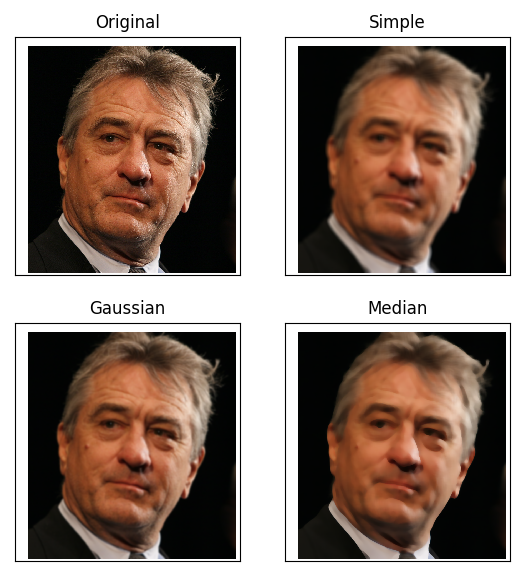
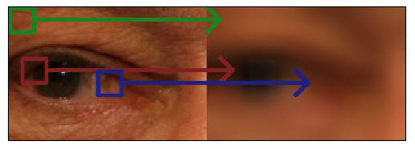
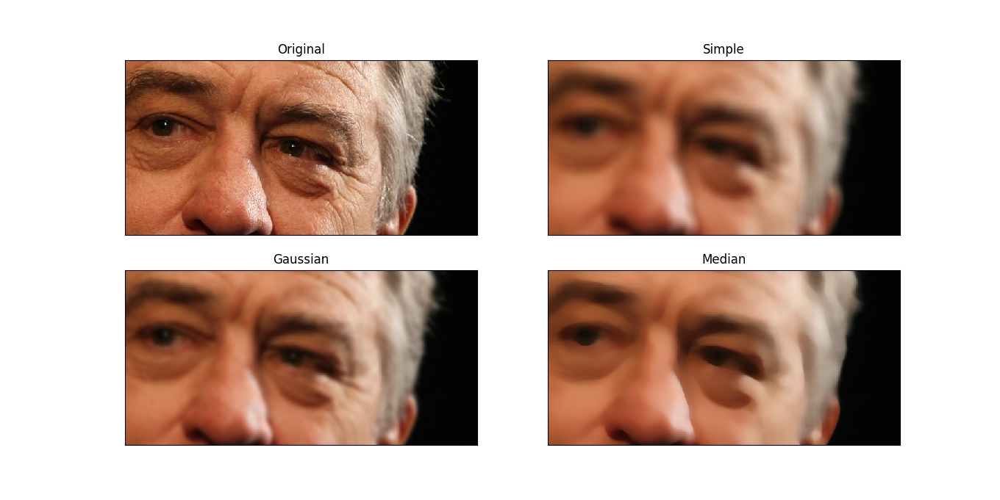
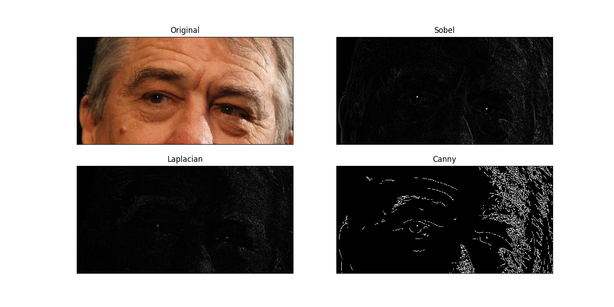
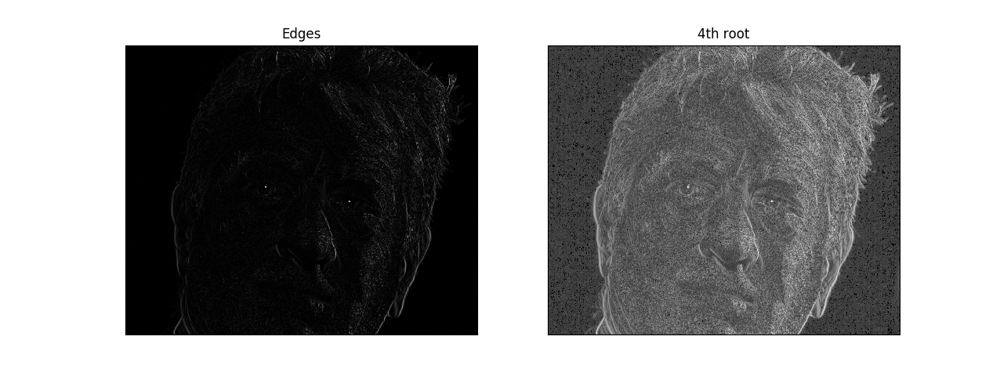
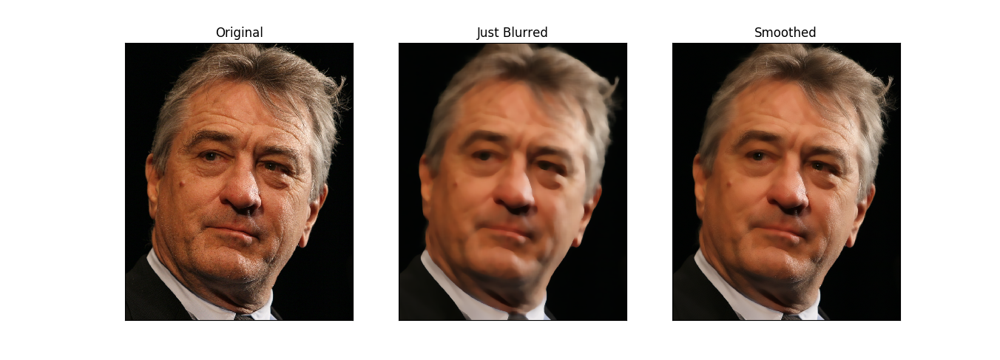

*NOTE*: This article has been translated from Farsi using `llama3-70b-8192` and `groq`

One of the most wonderful tools for those who deal with image processing is the OpenCV library. The people behind the development of this library have put in a lot of effort and money, and it is definitly worth it. You can find more information about this library at this [address](https://opencv.org/about.html), so I won't repeat it.

My goal in this post is to introduce simple tasks that can be done with this library and finally implement a lightweight but interesting image processing algorithm.

## Introduction
Before we start discussing, I need to review a few things. First, the inputs and outputs of OpenCV functions in Python are multi-dimensional arrays (tensors) of type numpy. Numpy is a large library designed for numerical computations in Python. I won't explain numpy here, as we don't need it much in this stage. Just know that working with numpy arrays is similar to working with lists. Additionally, you can index a part of a multi-dimensional array and work with it, which is very useful.

For example, the following code:
```python
import numpy as np
x = np.ones((3,3), np.float)
x[1:,1:] = 0
print(x)
```
First, we import numpy and assign it the alias `np`. Then, we create a 3x3 matrix with all elements equal to 1. Next, we set the values of the 2x2 submatrix at the bottom right of the original matrix to 0, and finally, we print the result.

By the way, you can install numpy and OpenCV using the following commands:
```bash
pip install --upgrade pip
pip install --upgrade setuptools
pip install --upgrade numpy
pip install --upgrade opencv-python
```

OpenCV functions take multi-dimensional arrays as input, process them, and return multi-dimensional arrays as output. It's easy to guess that a color image would be a 3-dimensional array, where the first two dimensions are the height and width of the image, and the third dimension is the color channel.

The range of values in images is between 0 and 255, and their type is np.uint8, just like our own byte. Therefore, when working with OpenCV, you'll often see np.uint8 instead of np.float, which was used in the code above.

## Image Blurring and Median Filtering
Everything that's in the book by Mr. Gonzales (Digital Image Processing) is in OpenCV, and more. To keep this post concise, I'll refer you to that book for explanations of each operation, and maybe I'll write about them later.

There are various methods for blurring an image, each suitable for a specific type of noise. (None of these methods produce perfect results, especially when deep neural networks are used to solve this problem!)



Assuming we've read the input image using:
```python
import cv2
import numpy as np
image = cv2.imread('robert_de_niro.jpg')
```

The first method is simple averaging. This method replaces the value of each pixel with the average of the neighboring pixels.



This method reduces the noise of each pixel by averaging the noise levels, which is approximately zero. The following command does this:

```python
simple = cv2.blur(image, (21, 21))
```

Of course, the two numbers 21 are the length and width of the window I mentioned.

The next method uses a Gaussian kernel. If we calculate the weights based on the distance of each pixel from the central pixel, we get Gaussian blurring. This method generally produces more pleasing results than simple averaging:
```python
gaussian = cv2.GaussianBlur(image, (21, 21), 0)
```

The zero after the window size is the standard deviation of the Gaussian distribution.

Another solution is to calculate the median of the neighboring pixels. This method is useful for salt and pepper noise (random black and white dots in the image). This one is also a single line of code:
```python
median = cv2.medianBlur(image, 21)
```

For the median method, the window size must be odd, so only one number is needed. This is not a theoretical limitation, but a limitation of OpenCV's implementation.

For better comparison, take a look at the zoomed-in version:



## Edge Detection
One of the most important pieces of information in images is the edges. Edges are usually detected by calculating the gradient (multi-dimensional derivative) of the image.



One of the edge detection methods is the Sobel operator. In this method, the values of a 3x3 window around each point are considered, and the (weighted) differences between the two sides of the window are calculated. To do this, a kernel is used, which is a 3x3 matrix:

$$$
K=\left[\begin{array}{cc}
-1 & 0 & 1 \\
-2 & 0 & 2 \\
-1 & 0 & 1
\end{array}\right]
$$$

The command for this is:
```python
sobel = np.absolute(cv2.Sobel(image, cv2.CV_32F, 1, 0)).mean(2)
```

Another method is the Laplacian operator. To put it simply, it uses the following kernel:

$$$
K=\left[\begin{array}{cc}
0 & 1 & 0 \\
1 & -4 & 1 \\
0 & 1 & 0
\end{array}\right]
$$$

The command for this is:
```python
laplacian = np.absolute(cv2.Laplacian(image, cv2.CV_32F)).mean(2)
```

The last method, not the least important, is the Canny edge detector. This method applies Gaussian blurring first, then calculates the gradient, and finally applies hysteresis to detect strong and weak edges. This is a bit complicated, but it's one of the best edge detection methods!
```python
canny = cv2.Canny(image, 100, 200)
```

The two numbers, 100 and 200, are the hysteresis thresholds.

## A Salt-Free Example
So far, we've seen how averaging and gradient calculations can ruin an image. Now, if we want to smooth an image while preserving its edges, what should we do?

My suggested method is to first detect the edges, then blur them to create a matrix where the values are 1 on the edges and gradually decrease to 0 away from the edges. This way, we can preserve the original image in the edge areas and blur the rest.

We start with the Sobel operator:
```python
edges = np.absolute(cv2.Sobel(image, cv2.CV_32F, 1, 0)).mean(2)
```

Then, we normalize the values to be between 0 and 1:
```python
edges = (edges - edges.min()) / (edges.max() - edges.min())
```

Now, to preserve more of the original image, we take the fourth root of the values. This makes the values closer to 1 closer to 1, and the values close to 0 remain close to 0:
```python
edges = edges ** 0.25
```

The effect of this is shown in the image below:



Now, we need to create a blurred version of the image:
```python
blurred = cv2.medianBlur(image, 21)
```

Finally, we combine the original and blurred images using the edge values as weights. This way, the original image is preserved in the edge areas, and the blurred image is used elsewhere.
```python
edges = np.expand_dims(edges, 2)
edges = np.tile(edges, (1, 1, 3))
blurred = cv2.medianBlur(image, 21)
final = (1 - edges) * blurred + edges * image
final = final.astype(np.uint8)
```

The first two commands are just for compatibility with 3D images. The final result is:



To facilitate comparison, I've placed the original image on the left, the blurred image in the middle, and the final result on the right.