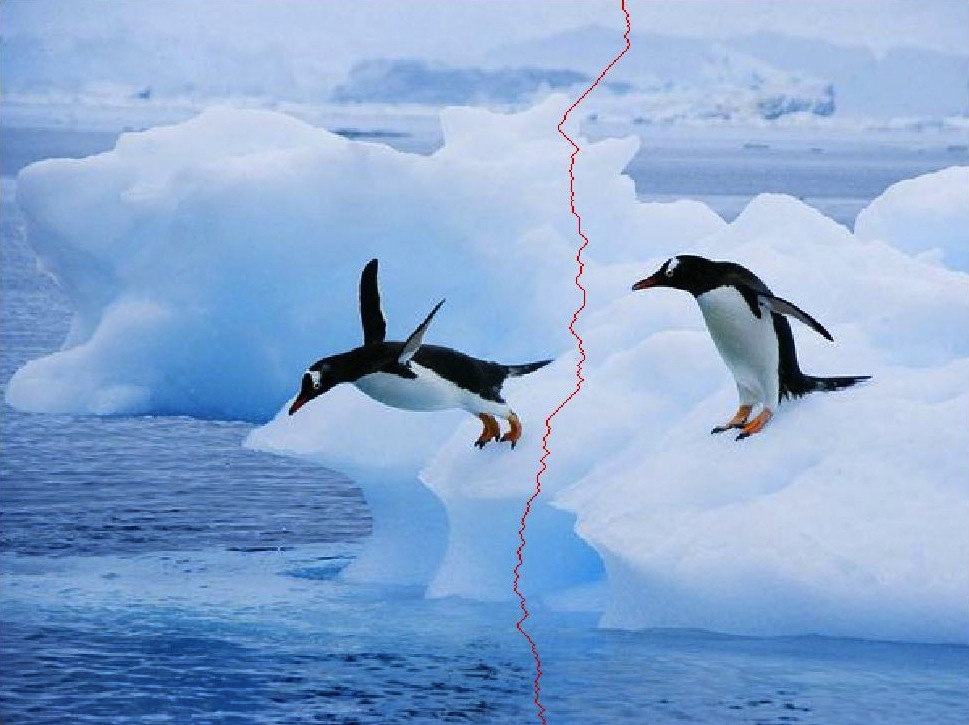
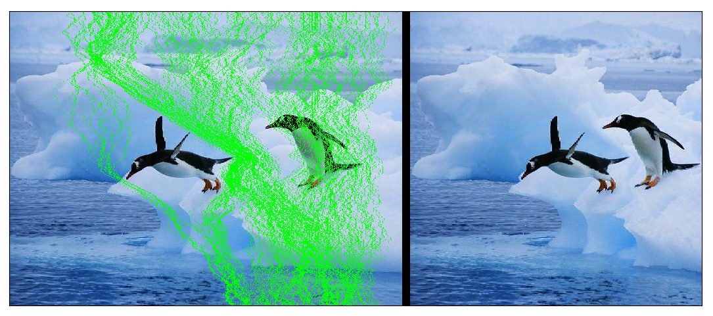
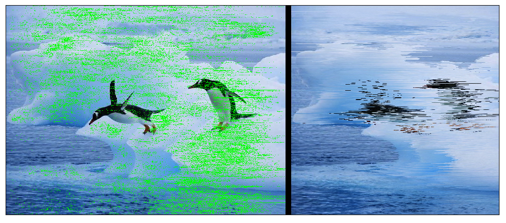

*NOTE*: This article has been translated from Farsi using `llama3-70b-8192` and `groq`

With the OpenCV library, many things can be done, from basic image processing to machine learning. In this post, which will not be the middle post of a trilogy! -- I will review how to use OpenCV to reduce the size of an image by removing the minimum amount of data. This process is called seam carving in image processing literature.

We want to apply this technique to the following image of penguins:


The human eye is sensitive to changes within an image. In other words, preserving the data within an image means preserving the parts of the image where the gradient is larger than the rest of the points:

$$$
D(X)=|S_x*X|+|S_y*X|
$$$

The operator $*$ represents convolution, and $S_x$ and $S_y$ are the Sobel kernels in the horizontal and vertical directions, respectively:

$$$
S_x=\left[\begin{array}{ccc}
-1 & 0 & 1\\
-2 & 0 & 2\\
-1 & 0 & 1
\end{array}\right],
S_y=\left[\begin{array}{ccc}
-1 & -2 & -1\\
0 & 0 & 0\\
1 & 2 & 1
\end{array}\right]
$$$

The output of function $D$ in seam carving is the energy matrix. Therefore, the first step in performing seam carving is to write function $D$ or the energy calculation function:
```c++
cv::Mat computeEnergyMatrix(const cv::Mat& _image)
{
    cv::Mat sobelX, sobelY;
    cv::Sobel(_image, sobelX, CV_32F, 1, 0);
    cv::Sobel(_image, sobelY, CV_32F, 0, 1);
    cv::Mat energyMatrix = cv::abs(sobelX) + cv::abs(sobelY);
    cv::transform(energyMatrix, energyMatrix, cv::Matx13f(1,1,1));
    return energyMatrix;
}
```

When we apply this function to an input image, it assigns a weight to each point in the image, indicating the importance of that point.

Now, assume we want to reduce the width of the image. To do this, we need to remove some of the image's columns. But the importance of the points within a column of the image is not the same. So, instead of removing some columns, we find the paths from top to bottom of the image that have the minimum importance and remove them:



If you're careful, you might have asked yourself, "Why not select the point with the least importance from each row and then remove it?" That's a good question. It's good to write the code for this and see the output. The answer to this question is at the end of this post, and you can implement it yourself and test it (you can take the code related to this post from https://gitlab.com/vedadian_samples/fun-with-opencv-2.git and modify it).

But how do we find the vertical path with the minimum energy? Calculating the energy of all vertical paths within an image is impractical. That's why we use dynamic programming. If you're not familiar with this method, Wikipedia explains it well (https://en.wikipedia.org/wiki/Dynamic_programming).

The result of applying dynamic programming is that, starting from the second row of the image matrix, we assume that the energy of the best vertical path up to the previous row is available at each point. With this value, we consider the energy of the paths to the neighboring points and add the least value to the energy of this point. It's obvious that this value will be the energy of the best vertical path up to this point. With this command, we can go up to the last row of the image matrix.

What's left is the energy of the best path for the points related to the first row. But the paths related to the first row points are themselves, since there were no other row points before them!

In summary, the code below finds the vertical path with the minimum energy and returns it:
```c++
#define MAX_DEVIATION   2
std::vector<int> findVerticalSeam(const cv::Mat& _energyMatrix)
{
    int m = _energyMatrix.rows, n = _energyMatrix.cols;

    cv::Mat pathEnergy = cv::Mat::zeros(cv::Size(n, m), CV_32FC1) + std::numeric_limits<float>::max();
    _energyMatrix(cv::Rect(0, 0, n, 1)).copyTo(pathEnergy(cv::Rect(0, 0, n, 1)));
    cv::Mat offsets = cv::Mat::zeros(cv::Size(n, m), CV_32SC1);
    for(int i = 1; i < m; ++i) {
        for(int j = 0; j < n; ++j) {
            for(int o = -1; o <= 1; ++o) {
                if(j + o >= 0 && j + o < n) {
                    float offsetCost = pathEnergy.at<float>(i - 1, j + o) + _energyMatrix.at<float>(i, j);
                    if(pathEnergy.at<float>(i, j) > offsetCost) {
                        pathEnergy.at<float>(i, j) = offsetCost;
                        offsets.at<int>(i, j) = o;
                    }
                }
            }
        }
    }
    std::vector<int> seam(m);
    seam[m - 1] = 0;
    for(int i = 1; i < n; ++i)
        if(pathEnergy.at<float>(m - 1, i) < pathEnergy.at<float>(m - 1, seam[m - 1]))
            seam[m - 1] = i;
    for(int i = m - 1; i > 0; --i)
        seam[i - 1] = seam[i] + offsets.at<int>(i, seam[i]);
    return seam;
}
```

I should have said this earlier, but better late than never. A vertical path from the top of the image to the bottom is a collection of points that start from the top row and reach the bottom row, while being neighbors of each other at each step.

The result of applying this method is shown below:



Now, let's do this for the penguin image above. The result is as follows:



As I mentioned, the implementations of seam carving in Python and C++ are available at https://gitlab.com/vedadian_samples/fun-with-opencv-2.git.