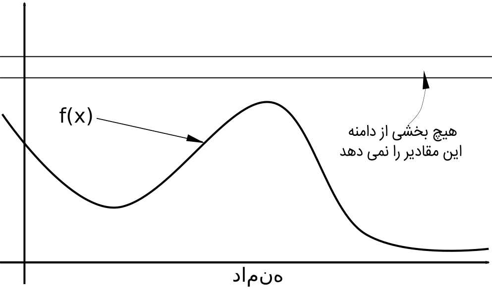
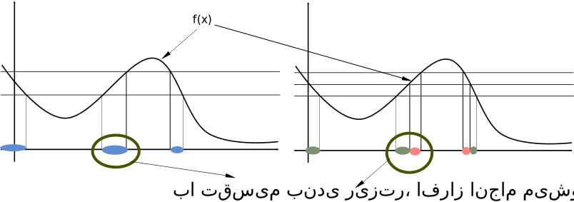

*NOTE*: This article has been translated from Farsi using `llama3-70b-8192` and `groq`

*Preamble:* Before starting the second part of this series, I must confess that *practical examples* of measures are not like algorithm examples. Measures are a level of mathematical abstraction that enables precise and stable integral calculations, particularly in probability theory. Thus, their application is more about illumination and expanding our horizon. My point is that by using this abstraction, we can see some problems from a different angle, making them simpler - or even possible - to solve.

*Main topic:* We saw that after changing the viewpoint in integral calculation and switching from dividing the domain to dividing the function's range, the concept of "measure" can enable calculating integrals for more instances of functions. So, we must take "measures" more seriously.

Measures are functions that take a set as input and output a positive real number. This means that the domain of measures is a collection of sets. Therefore, it is not bad to get to know the domain of these functions better.

## $sigma$-Algebras
Let's start with dry mathematical definitions, just for the sake of variety.

**Definition** Suppose $D$ is a set, and $2^D$ is the power set of $D$ (the set of all subsets of $D$). Any subset $\Sigma\subseteq 2^D$ that satisfies the following three conditions is a $sigma$-algebra:
1. $D$ is in $\Sigma$: $D\in\Sigma$
2. $\Sigma$ is closed under complementation: $A\in\Sigma\Rightarrow D-A\in\Sigma$
3. $\Sigma$ is closed under countable unions: $A_1,A_2,A_3,\ldots\in\Sigma\Rightarrow \cup_{i=1}^\infty A_i\in\Sigma$

How does this relate to our discussion?

To define a measure on a series of subsets, these subsets must have good properties. Remember, when we divide the range of a function, there is a unique subset of the domain for each point in the range.

Look at the properties listed again. First, the entire domain must be in the $sigma$-algebra, because measures must be able to measure the entire domain we are interested in. Second, it should be closed under complementation, because measures should be able to measure the complements of subsets. Third, it should be closed under countable unions, because measures should have uniform behavior on the union of subsets. Suppose measures could measure a series of subsets of the domain but could not measure their union; it would be ridiculous! What would happen to integral calculation on parts of the domain?

So, the suitable domain for measures are $sigma$-algebras. This is where questions like "What is the probability of $X$ taking value from countably infinite number of distinct values if $X$ has a Gaussian distribution?" become meaningful.

The answer to such questions is that we cannot deal with these types of subsets. They are not in our $sigma$-algebra and therefore are not measurable!

# Measure Definition
Let's start with dry mathematical definitions again:

**Definition** Suppose $X$ is a set, and $\Sigma$ is a $sigma$-algebra on $X$. A function $\mu$ from $\Sigma$ to $\mathbb{R}\cup \{-\infty, \infty\}$ is a measure if:
1. Its range includes only non-negative values: $\forall E\subseteq X\Rightarrow \mu(E) \ge 0$
2. Its output for the empty set is zero: $\mu(\emptyset)=0$
3. It is countably additive: $\mu\left(\cup_{i=0}^\infty E_i\right)=\sum_{i=0}^\infty \mu(E_i)$

You see, again, the effect of the $sigma$-algebra can be felt. Especially in the third condition. If the sigma-algebra is not closed under countable unions, we cannot define such a condition; the union of subsets may not be in the domain, let alone have a relationship between the output value and the sum of the measure values of each subset.

If you paid attention to the previous paragraph, you noticed that I called the output value of a measure the "size" of a set. In reality, in the theory of measures, this is called the "measure" of the set, which is not a bad name. However, to me, a measure is more suitable for a function that "measures" the size of a set.

Now, let's take a closer look at the conditions for being a measure. First, the range of the function is only non-negative values. The reason for this condition is clear from the intuition of integral calculation. The area of a rectangle cannot be negative, no matter how you measure the sides! The second condition is also clear. A set with no members has a size of zero. If we go back to integral calculation, if the function has no values in a range of values, the area under the curve for that range does not exist:

But the third condition. If this condition did not hold, the value of integral calculation would vary for different partitions. Remember, we divided the range of the function and made those divisions finer and finer, and the limit became the integral value. If the size of the union of several subsets were not equal to the sum of their sizes, we would not have any guarantee for the existence of the limit. The intuition is also clear. Human measurement also calculates the size of the union of two sets in this way:

So, measures are not strange creatures. They are precise observations of a mathematician, reflecting how we deal with measurement. But the beauty of mathematics lies in abstraction. When we have a good definition of a measure, we can investigate problems that we did not know how to approach before.

Now it's time to examine an example of using this abstraction.

# Example
Let's look at the calculation of expected value in a different way. We have a function $f$ with a probability distribution over its domain. For example, $f$ might be the amount of damage caused by impurities in the raw materials of IC production, measured in milligrams per liter. Assume the probability of a specific amount of impurity in the materials has a Gaussian distribution (a reasonable assumption, according to the central limit theorem).

Now we want to know the average amount of damage in the produced ICs. To calculate this, we need to take the expected value:

$$$
l=\mathbb{E}f(X)=\int f(X)dP(X)
$$$

One way to calculate this is numerically or formulaically. Another way is to generate several samples from the distribution $P$. For example, 100 samples; $X_0,\ldots,X_{99}$. Since these samples are generated from the measure $P$, their density is proportional to the same measure. So, we can estimate the damage value as follows:

$$$
l=\mathbb{E}f(X)\approx \sum_{i=0}^{99} f(X_i)
$$$

In this problem, calculation is not very interesting; but suppose we do not have the distribution of impurities in the raw materials and only have some measured data from past days. The problem becomes different.

If you are familiar with Kalman filtering, you should know that there is a version of this filter for unknown distributions, called particle filtering.

The method of integral calculation I introduced is called Monte Carlo integration.