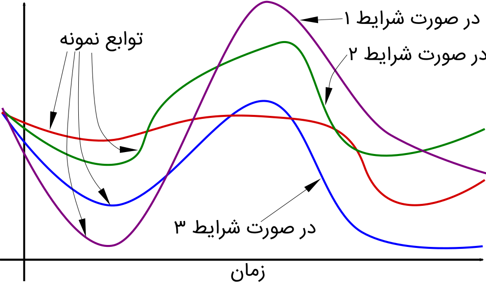

*NOTE*: This article has been translated from Farsi using `llama3-70b-8192` and `groq`

Random processes are familiar to students in many fields, including electrical engineering, artificial intelligence, aerospace engineering, economics, and more. Any function whose values are random from our perspective is considered a random process. Examples include the values of an electromagnetic signal received by a mobile phone, the stock price of a company over time, and the displacement of a component in a mechanical system.

We can study random processes in a classical framework, but it is more concrete and provides better insights when studied in the context of measure theory. (Kudos to the measure theory!)

Now, let's consider a problem related to random processes. Suppose we want to calculate the integral of a function $f$ over a specific interval (e.g., from 0 to 1), but we don't have the function itself. Instead, we have samples of the function's values that we can measure. This is a practical problem. We often don't have complete information about the functions we deal with and only have limited measurements available.

One of the initial and useful solutions is to connect the available points with a straight line. This gives us a piecewise linear function, and we can calculate its integral. Alternatively, we can fit a quadratic curve to any three points and approximate it. Many of these methods are taught to students in numerical computation courses.

But what if we have probabilistic information about the function $f$? Can we use it to reconstruct the function or calculate its integral? Essentially, what does probabilistic information about functions mean?

This is where measures come in. We can't easily measure a set of functions using common tools (e.g., assigning probabilities to them).

*Warning*: The problem presented above (calculating the integral of an unknown function) is not the main topic here. From now on, we'll focus on measures on the set of functions, particularly the Wiener measure, which is the probability distribution of the Wiener process.

## Wiener Measure
You definitly are familiar with Mr. Wiener. The Wiener filter is named after him. Mr. Wiener was an American mathematician and philosopher who taught at MIT. He was one of the first to study the properties of sample functions of random processes. If it's not clear, sample functions of a random process are functions we face if we knew the exact state of realization of a random process. For example, if I know the exact status of a communication channel (like an urban space), the received electromagnetic signal becomes a simple function of time for me. We don't need to be omniscient; even our mobile phones deal with sample functions everyday.

Finding the properties of sample functions of a random process is a fascinating problem. Mr. Wiener proposed a Gaussian measure for the probability of events in these functions.

If we've reached this point correctly, you might ask, what $sigma$-field is this measure defined over? Let's assume we know the values of the functions of interest at times $t_0, t1, \ldots, tn$, and they are within specific intervals. For example, at time $t_0$, the values are within the interval $(5,10)$, at time $t_1$, they are within the interval $(8,11)$, and so on. We'll label these intervals $A_0$, $A_1, \ldots, A_n$. With this knowledge, we've practically described a subset of sample functions of a random process. Among all sample functions, we're interested in those that take specific values at specific times.

Let's define the measure for this subset:

$$$
\mu\left(C(t_0,\ldots,t_n;A_0,\ldots,A_n)\right)=
\int_{A_0}\int_{A_1}\cdots\int_{A_n}p(t_n-t_{n-1},x_n-x_{n-1})\ldots p(t_0,x_0)dx_ndx_{n-1}\ldots dx_0
$$$

The function $p$ is a Gaussian form, $p(a,b) = (4πa)^{-n/2} e^{-|b|^2/4t}$.

With this measure, we can do interesting things. For example, what is the expected value of the squared amplitude of functions that follow the Wiener distribution?

$$$
\mathbb{E}(|\omega(t)|^2)=\int p(t,x)|x|^2dx=2nt
$$$

Thus, the expected value of the amplitude of a sample function with this distribution is $\sqrt{2nt}$.

A process with a probability distribution defined by the Wiener measure is called a Wiener process (isn't that obvious?).

The Wiener process has extensive applications in physics and financial mathematics.

## Conclusion
It seems that, unintentionally, I've developed a special interest in trilogies. Anyway, IMHO, continuous discussions about measures are beyond the scope of posts like this. The purpose of this series was to spark curiosity and interest in readers for advanced topics in probability theory. I provided a practical example of the benefits of shifting perspectives and explored a more advanced probability problem that would encourage further study in this field.