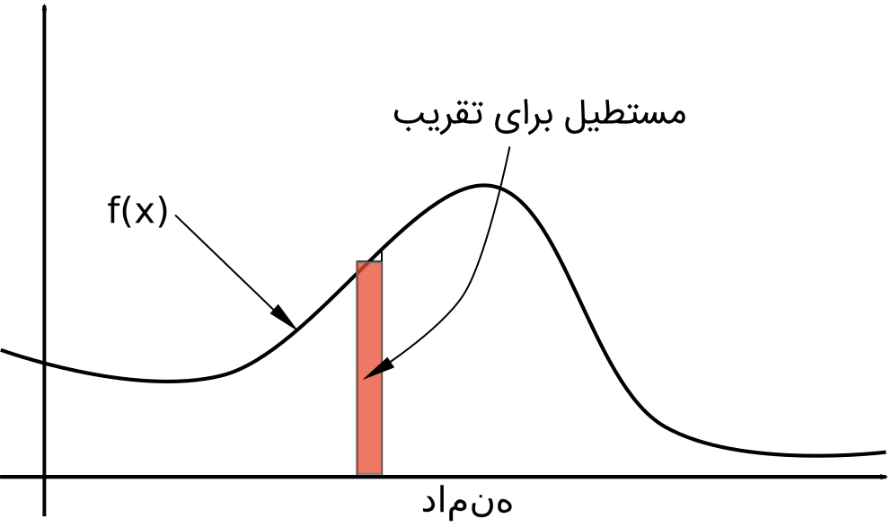
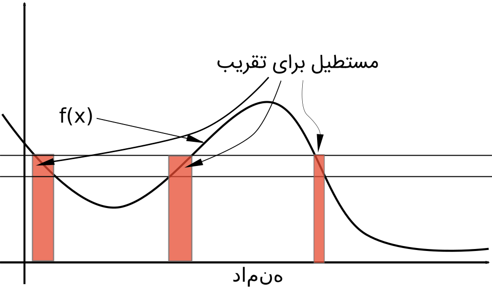
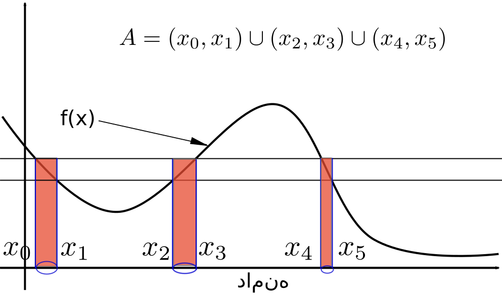

*NOTE*: This article has been translated from Farsi using `llama3-70b-8192` and `groq`

If you are a graduate student in technical or mathematical fields or have been before, you have certainly encountered integrals in the form of:

$$$
\int_D f(x)d\mu(x)
$$$

Especially if you delved into serious and new papers related to statistics and probability, which I am confident is the case.

The first time I encountered this type of integral was during my master's studies in the Electrical Engineering department at Amir Kabir University. When I was reading papers by prominent figures like [Thomas Kailath](https://en.wikipedia.org/wiki/Thomas_Kailath) and [Simon Haykin](https://en.wikipedia.org/wiki/Simon_Haykin), these integrals seemed strange and fascinating to me. Honestly, my extreme enthusiasm for mathematics is evident from my writings; however, even if I didn't have this enthusiasm, seeing these integrals would still spark my curiosity. In artificial intelligence, the good read "Statistical Learning Theory" by Vapnik also deals with these types of integrals.

Apparently, the new approach to dealing with integrals originated in the late 19th century through the work of French mathematician [Émile Borel](https://en.wikipedia.org/wiki/%C3%89mile_Borel). The theory was later developed by another prominent French mathematician, [Henri Lebesgue](https://en.wikipedia.org/wiki/Henri_Lebesgue), which laid the foundations of mathematical analysis.

Leaving aside this brief history, the first thing I want to discuss is why we need to acquaint ourselves with new types of integrals when we are already familiar with Riemann and similar integrals and have learned them in high school and early university years?

The first answer is that it's not necessary! Someone who is content with their current knowledge and explores other areas of interest can do so without getting entangled in these integrals. However, if, like me, you have encountered these integrals in your field of work or interests, the answer is that these new integrals have significantly improved mathematical analysis, revolutionized probability theory, and made it possible to study new subjects by creating more abstractions.

It is clear that in a place like my blog, there I can not go for an in-depth examination of this subject. My intention is to partially open up the subject from a general perspective and motivate the relatively interested reader.

## Washing the Eyes
From high school, we remember that when we wanted to calculate the area under a curve specified by $f(x)$, we divided the domain into very small pieces and calculated the value of $f(x)$ at each piece, approximating the area of a small piece of area under the curve with a small rectangle.

The more fine-grained the divisions, the more the resulting value is close to the area under the curve. The limit of these approximations, when the number of rectangles becomes infinite, is the area under the curve:

$$$
\int f(x)dx=\text{lim}_{n\rightarrow \infty} \sum f(x_i)(x_{i+1}-x_{i})
$$$

However, this method has several problems. One issue is that the validity of this approximation only holds when the domain over which the integral is calculated is bounded. In practice, when calculating integrals over unbounded domains, we must recompute the limited integral calculation. Another issue arises when this unbounded domain is combined with another unbounded domain, such as when calculating a double integral $\int\int$, various technical problems emerge.

Now, let's look at it differently. If, instead of dividing the domain, we divide the range of the function, and then consider the area of all the rectangles formed for each piece of the range, what happens?

Intuitively, we can approximate the area under the curve by summing the areas of these rectangles. The key that makes this method of calculating integrals so different is that, instead of considering these rectangles individually, we consider a "measure" that measures the parts of the function's domain where the function values fall within a specific range

In the example of Figure 3, we can calculate the area of all the rectangles using the formula:

$$$
\text{area}=y_i\mu(A)
$$$

where $A$ is the subset of the function's domain separated by the blue ellipses, $\mu$ is the measure function that measures the size of this subset, and $y_i$ is the function value in this subset of the domain.

This simple trick enables many operations. In the example of Figure 3, if the $\mu$ function returns the value $|x_1-x_0|+|x_3-x_2|+|x_5-x_4|$ for $A$, the calculated integral will be exactly equal to the Riemannian version. However, this is not the only useful measure for integrating function $f$. Another important example of a useful measure is the probability distribution measure.

Let's assume we know the probability of our input function $f$ falling within specific ranges. We'll call this measure P. Mathematically, what we said becomes:

$$$
P(x\in A)=\mu(A)
$$$

Now we can calculate another integral. The value of this integral is the expected value of function $f$. Previously, to calculate the expected value of function $f$, we first obtained the probability density function $p(x)=dP/dx$; then, we calculated the integral:

$$$
\mathbb{E}(f(x))=\int f(x)p(x)dx
$$$

However, with the new formulation, we can write:

$$$
\mathbb{E}(f(x))=\int f(x)dP
$$$

In this form, we don't even need P to be differentiable. Our function's domain doesn't need to be one of those well-behaved domains we've encountered before. For example, our function's domain can be a set of functions itself. Functions whose domain is a set of functions are called functionals in mathematics.

You see! With a change of perspective, a new area of research and application emerges. Exploring functionals. If you think these are just abstract concepts that mathematicians are enthusiastic about, I refer you to the same names mentioned at the beginning of this post. Vapnik and Kailath and Haykin. They are all accomplished mathematicians, and their work is more focused on application than pure theory. The last two are practically electrical engineers who have worked in signal processing.

If these examples cannot demonstrate the practicality of this area of mathematics, I'll provide an example of these functionals. The familiar Fourier transform is a functional. Remember, this functional takes a continuous function and a real value and returns another real value:

$$$
F(f,\omega)=\int f(x)e^{j\omega x}d\mu(x)
$$$

The measure $\mu$ in the above formula is the Lebesgue measure. The same one that returns the value $|x_1-x_0|+|x_3-x_2|+|x_5-x_4|$ for set $A$ in Figure 3.

I hope I have been able to sharpen your appetite enough to continue discussing the theory of measures and integrals. In the next posts, we'll delve a bit deeper into the measure theory and explore one or two practical examples; hopefully, it will be beneficial for someone!