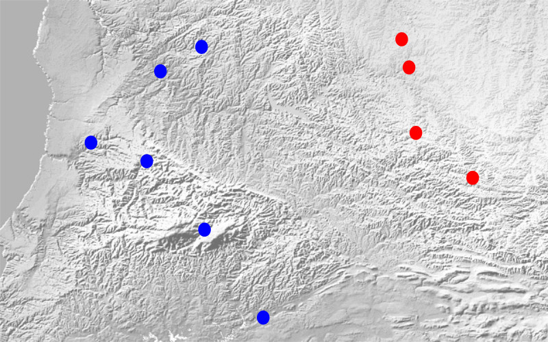
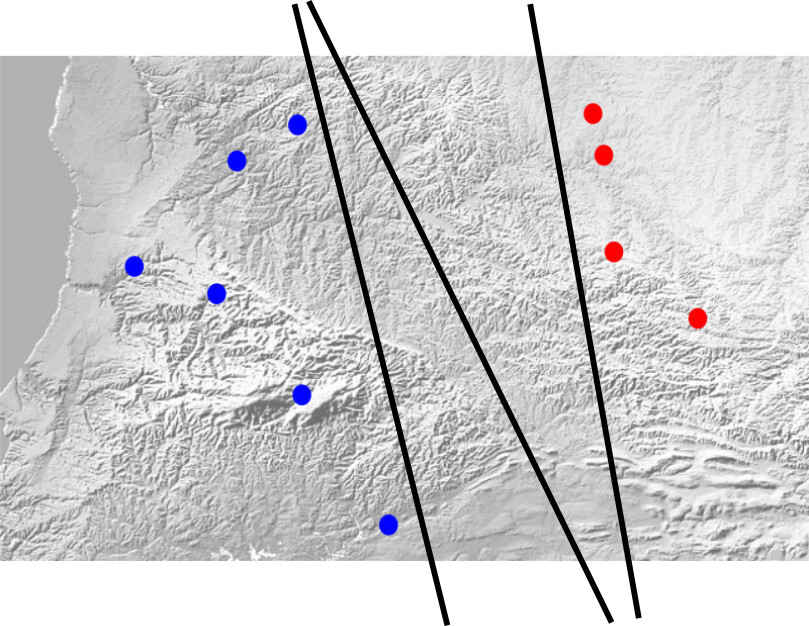
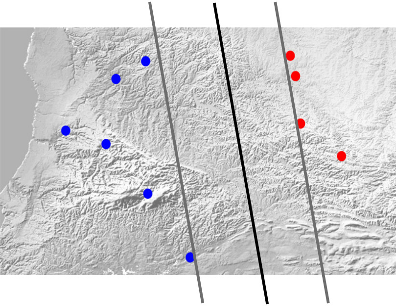
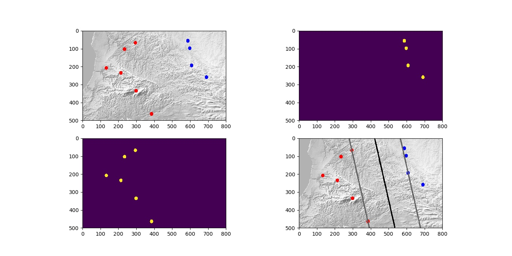

*NOTE*: This article has been translated from Farsi using `llama3-70b-8192` and `groq`

**Understanding How the Computer Learns - Learnable Models**

In the [previous section](/learnable-models-this-understanding-computer-how-does-it-learn), I wrote about computers and how they learn. In the middle of that article, I referred to my simple and dear friend, the straight line. Although it has limited capabilities, it can be useful and make the computer learn.

I think it's time to see the real result of a simple training using this straight line function. Let's think about it.

Suppose two tribes of people have built their homes in a geographical region. After a while, a dispute arose over which part of the region belongs to each tribe. Our computer doesn't know how to deal with this kind of problem, as it didn't exist at that time.

Now, we want to show the computer the points where each tribe has built their homes and then ask it to tell us which tribe each point belongs to. (Please don't laugh at the simplicity of the problem; I've thought it through carefully!)



So, we have some points representing the homes of the blue tribe and some points representing the homes of the red tribe. The straight line we saw in the previous post has two parameters: one representing the slope of the line and the other representing the y-intercept ($a$ and $b$ in the formula $y=f(x)=ax+b$).

In the classroom, we need to learn the suitable values of $a$ and $b$ that maximize the distance from the homes of both tribes and still keep each tribe on one side of the line corresponding to these parameters.

By looking at the straight line formula ($y-ax-b=0$), we can guess the result of being on one side of the line. If we put the coordinates of points on the line into the formula, we get zero. But if several points are on one side of the line, the sign of the value obtained from putting their coordinates into the formula will be the same.

Let's agree that the sign for the red tribe is negative and the sign for the blue tribe is positive. It seems things are moving forward. There's just one more thing to consider. The number of lines that can separate the two sets of points is countless.



Each of the black lines in the image above can be a solution. Of course, we forgot one thing! The line should have the maximum distance from the homes of both tribes. To fulfill this condition, instead of one separating line, we consider two parallel lines. One of them goes up to the closest point of the blue tribe, and the other goes up to the closest point of the red tribe. These two lines represent the distance from each tribe. Now it's enough to maximize the distance between these two lines, and the final separating line will be their average.



Since we said the supporting lines are parallel, they have the same $a$ parameter. But they don't have the same y-intercept; for example, one is $b_0$ and the other is $b_1$.

Our problem can be expressed as:

$$
\begin{array}{l l}
\text{Maximize } \frac{\mid b_0-b_1 \mid}{1+a^2} & \\
\text{subject to} & l_i(y_i-ax_i-0.5(b_0+b_1)) > 0
\end{array}
$$

The concept of the above formula is to maximize the value of $\frac{\mid b_0-b_1 \mid}{1+a^2}$ while ensuring that for all points (both red and blue), the sign of the value obtained from putting their coordinates into the formula is positive. This means the line correctly predicts the tribe.

Oh! Another problem! For a simple problem like this. What we've got so far is not a convex problem, and optimization tools can't solve it with a suitable guarantee. But the solution to this problem is not difficult. It's enough to rewrite the straight line formula. We've seen this in high school:

$$ay+bx+c=0$$

By doing this, we add an unnecessary degree of freedom to the line formula. But this unnecessary degree of freedom can solve many problems. We don't need to consider the y-intercept of the supporting lines. Now we consider the main separating line as $ay+bx+c=0$ and the two supporting lines as:

$$
\begin{array}{l}
ay+bx+c-1=0 \Leftarrow y-(-\frac{b}{a})x-(-\frac{c-1}{a})=0\\
ay+bx+c+1=0 \Leftarrow y-(-\frac{b}{a})x-(-\frac{c+1}{a})=0
\end{array}
$$

Note that although we've added an unnecessary degree of freedom to the line formula, the total degrees of freedom of the problem haven't changed!

Now our problem becomes:

$$
\begin{array}{l l}
\text{Maximize } \frac{\mid 2 \mid}{a^2+b^2} & \\
\text{subject to} & l_i(ay_i+bx_i+c) > 0
\end{array}
$$

By taking one more step, we reach a convex problem. It's enough to invert the objective function:

$$
\begin{array}{l l}
\text{Minimize } a^2+b^2 & \\
\text{subject to} & l_i(ay_i+bx_i+c) > 0
\end{array}
$$

Optimization tools can easily solve this problem, and the puzzle is solved. Now, whenever a dispute arises between the tribes, just give the point in question to the computer, and it will tell you which tribe it belongs to.

For those who want to follow these topics, I've written a [sample program](https://gitlab.com/vedadian_samples/straight-line-classification.git) in Python that finds the boundary line if you give it the map and tribe images.

If you take the program and run it, you'll see the following output:



To run the program, you need to install a few libraries. The first library is OpenCV for Python. Assuming you're using Ubuntu or Mint, you can install it with the following command:
```bash
sudo apt-get install python-opencv
```

The next libraries are `matplotlib`, `numpy`, `cvxopt`, and `cvxpy`. You can install them with the following commands:
```bash
sudo su
pip install --upgrade pip
pip install --upgrade matplotlib
pip install --upgrade numpy
pip install --upgrade cvxopt
pip install --upgrade cvxpy
```

Now, just copy the program from Git, or download it from [GitLab](https://gitlab.com/vedadian_samples/straight-line-classification/repository/archive.zip?ref=master), and run it with the following command:
```bash
python doit.py
```

I've added brief explanations throughout the code, which I hope will be helpful.