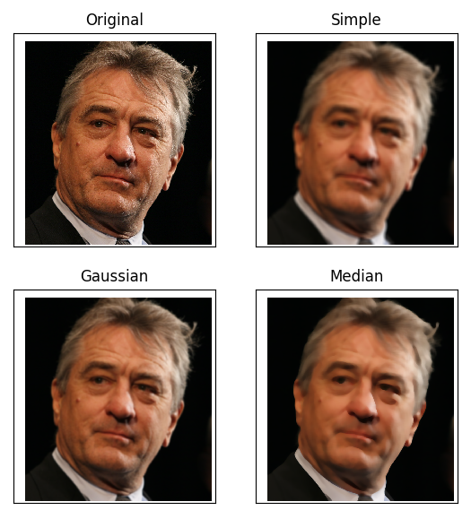
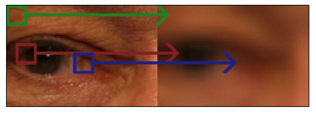
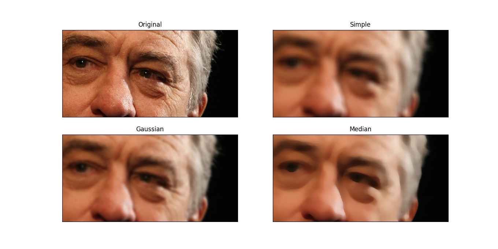
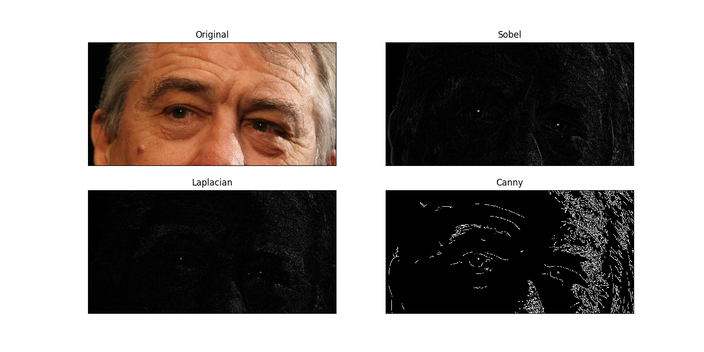
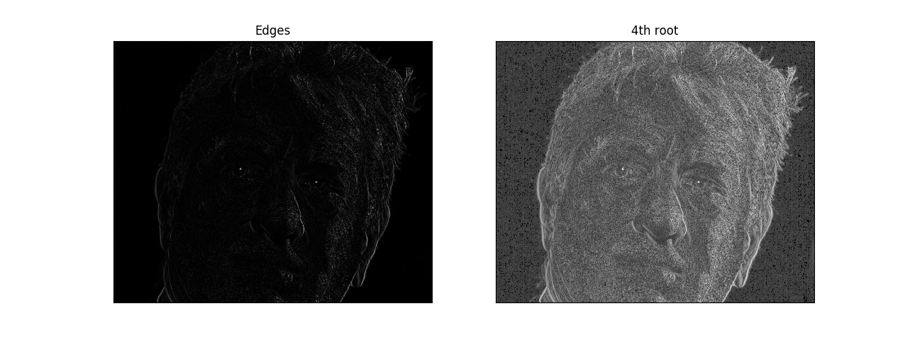
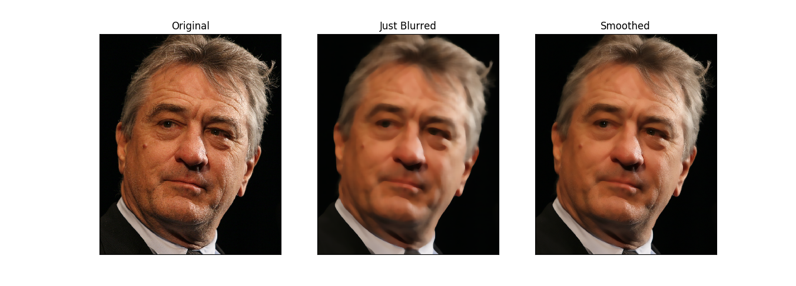

یکی از ابزارهای فوق‌العاده دوست داشتنی برای کسانی که سر و کارشان با پردازش تصویر می‌افتد، کتابخانه‌ی [OpenCV](https://opencv.org/) است. کسانی پشت توسعه‌ی این کتابخانه انرژی و پول صرف کرده‌اند که سرشان به تن‌شان می‌ارزد. توضیحات بیشتر راجع به این کتابخانه در این [آدرس](https://opencv.org/about.html) وجود دارد و تکرار آن اضافه گویی است.

سعی من در این پست این است که کارهای ساده‌ای که می‌شود با این کتابخانه کرد را معرفی کنم و در نهایت یک پردازش سبک ولی با نمک را هم پیاده‌سازی کنم.

## مقدمه
پیش از شروع متن صحبت، باید چند مورد را مرور کنم. اول اینکه خروجی و ورودی توابع OpenCV در پایتون، از جنس آرایه‌های چند بعدی (تنسور) [numpy](http://www.numpy.org/) هستند. خود numpy یک کتابخانه‌ی بزرگ است که برای انجام کارهای محاسبات عددی در پایتون طراحی شده. از توضیح راجع به numpy می‌گذرم، چون در این مرحله، کار زیادی با آن نداریم. فقط کافیست بدانیم که کار کردن با آرایه‌های numpy شبیه کار با لیست‌ها است. علاوه بر آن امکان آدرس دهی به بخشی از آرایه چند بعدی و کار با آن نیز وجود دارد که خیلی مفید است. مثلاً قطعه کد زیر:
```python
import numpy as np
x = np.ones((3,3), np.float)
x[1:,1:] = 0
print(x)
```
در اینجا اول numpy را به برنامه‌مان اضافه می‌کنیم. اسمش را هم می‌گذاریم np -- چون تنبلی اصل اساسی برنامه‌نویسی خوش فرم است! بعدش یک ماتریس ۳ در ۳ که همه‌ی عناصر آن ۱ است می‌سازیم. در انتها، مقادیر زیرماتریس ۲ در ۲ انتهایی آن را صفر می‌کنیم و آن را چاپ می‌کنیم. اگر این را در پایتون اجرا کنید، خروجی زیر را مشاهده خواهید کرد:

```
[[ 1.  1.  1.]
 [ 1.  0.  0.]
 [ 1.  0.  0.]]
```

یادم رفت بگویم که برای نصب numpy و OpenCV می‌توانید از دستورات زیر استفاده کنید:
```bash
pip install --upgrade pip
pip install --upgrade setuptools
pip install --upgrade numpy
pip install --upgrade opencv_python
```
البته دو دستور اول برای این هستند که سایر کتابخانه‌ها به درستی نصب شوند و من همیشه آن‌ها را در توضیحات می‌آورم ولی عملاً یکبار اجرا کردنشان کافی است!

توابع OpenCV مقادیری از جنس این آرایه‌های چندبعدی می‌گیرند و روی آن پردازش انجام می‌دهند و در نهایت مقادیری از جنس همین آرایه‌ها پس می‌دهند. می‌توان حدس زد که یک تصویر رنگی یک آرایه‌ی ۳ بعدی باشد که بعد اول و دوم آن، ارتفاع و عرض در تصویرند و بعد سوم عنصر رنگی. به همین ترتیب یک تصویر سیاه و سفید، یک آرایه‌ی ۲ بعدی است.

دامنه‌ی مقادیر موجود در تصاویر بین ۰ تا ۲۵۵ است و نوع آن‌ها np.uint8 -- همان بایت خودمان. به همین جهت معمولاً در کار با OpenCV به جای np.float که در قطعه‌ی کد اول همین زیربخش استفاده شد، np.uint8 خواهیم دید.

## متوسط‌گیری و بلور کردن تصویر
در OpenCV هر آن چیزی که در کتاب مرجع آقای [گنزالس](http://www.imageprocessingplace.com/root_files_V3/about_the_authors/gonzalez.htm) -- [پردازش دیجیتال تصویر](https://www.amazon.com/Digital-Image-Processing-Rafael-Gonzalez/dp/013168728X) -- آمده است وجود دارد و البته بیشتر. به همین جهت برای خلاصه‌تر شدن این پست، توضیح هر کدام از عملیات‌های انجام شده در این بخش و بخش‌های دیگر این پست را به مطالعه از این کتاب ارجاع می‌دهم و احتمالاً در زمانی دیگر در آن باره خواهم نوشت.

روش‌های مختلفی برای مات‌کردن تصویر وجود دارد که هر کدام برای مقابله با نوع خاصی از نویز مفید هستند (البته هیچکدام این روش‌ها نتایج قابل قبولی به دست نمی‌دهد، آن‌هم وقتی شبکه‌های عصبی عمیق برای حل این مسأله دست به کار شده‌اند!)



فرض کنید که تصویر ورودی را با استفاده از دستورات زیر خوانده‌ایم:
```python
import cv2
import numpy as np

image = cv2.imread('robert_de_niro.jpg')
```

روش اول که ساده‌ترین روش است، انجام متوسط گیری ساده است. در این روش، مقدار هر پیکسل تصویر با متوسط مقادیر پیکسل‌های درون یک پنجره اطراف آن پیکسل جایگزین می‌شود.



با این کار میزان نویز هر پیکسل می‌شود متوسط تقریبی میزان نویز که خوب طبیعتاً نزدیک صفر است. برای انجام این کار دستور زیر کافی است:
```python
simple = cv2.blur(image, (21, 21))
```
صد البته، دو عدد ۲۱ که در این دستور هستند طول و عرض پنجره‌ای هستند که معرفی کردم.

روش بعدی استفاده از یک کرنل گاوسی است. دقت کردید که در روش ساده، مقادیر پیکسل‌های درون پنجره‌ی مربوط به هر پیکسل با وزن یکسان در تولید خروجی نقش داشتند. حالا اگر این وزن‌ها بر اساس فاصله‌ی هر پیکسل از پیکسل مرکزی (همان که مقدار متوسط جایگزین آن خواهد شد) و تابع توزیع گاوس محاسبه شوند، بلوری کردن گاوسی را خواهیم داشت. این روش به صورت عمومی نتیجه‌ی انسان‌پسند‌تری نسبت به روش متوسط‌گیری ساده می‌دهد. این هم با یک دستور قابل اجراست:
```python
gaussian = cv2.GaussianBlur(image, (21, 21), 0)
```
اما این صفر بعد از ابعاد پنجره! این عدد به OpenCV می‌گوید که انحراف معیار مقادیر داخل پنجره را برای محاسبه‌ی وزن مدنظر قرار بده.

راه حل دیگر این است که در آن پنجره‌ی کذایی، بجای محاسبه‌ی متوسط، یا متوسط وزن‌دار، میانه محاسبه کنیم. میانه‌ی یک‌سری عدد، می‌شود عددی که در لیست مرتب‌شده‌ی آن‌ها در وسط قرار گیرد. مثلاً برای اعداد ۲،۳،۴،۴،۴،۵،۱۲،۱۶،۲۵ و ۲۵۵، مقدار میانه برابر ۵ است. این روش برای رفع نویز‌های فلفل نمک مفید است (نویزی که در آن مقادیر نویز یا خیلی بزرگند و یا خیلی کوچک، مثلاً نقاط تصادفی سیاه و سفید که در تصویر بصورت تصادفی بپاشیم.) این یکی هم یک سطر دستور است:
```python
median = cv2.medianBlur(image, 21)
```
در مورد میانه، ابعاد پنجره‌ی مورد نظر می‌بایست حتماً مربعی باشد، به همین جهت فقط یک عدد نماینده‌ی اندازه‌ی پنجره شده است. البته این محدودیت تئوریک نیست و پیاده‌سازی OpenCV اینطوری است.

برای مقایسه‌ی بهتر، یک نسخه‌ی زوم شده را ببینید:


## استخراج لبه‌های تصویر
یکی از اطلاعات مهم درون تصاویر، لبه‌های موجود در آن‌ها است. لبه‌های تصویر را معمولاً با محاسبه‌ی گرادیان (مشتق چند بعدی) بدست می‌آورند. حالا در روش‌های مختلف بلاهای مختلفی بر سر این گرادیان مفلوک می‌آید تا لبه‌ها آشکار شوند.


یکی از روش‌های لبه‌یابی استفاده از عملگر سوبل است. در این روش مقادیر یک پنجره‌ی ۳ در ۳ اطراف هر نقطه در نظر گرفته می‌شود و مقادیر (وزن دار شده‌ی) یک طرف این پنجره از طرف دیگر کسر می‌شود. به طور دقیق بسته به جهت اعمال مشتق‌گیری یک کرنل به شکل زیر برای محاسبه استفاده می‌شود:
$$$
K=\left[\begin{array}{cc}
-1 & 0 & 1 \\
-2 & 0 & 2 \\
-1 & 0 & 1
\end{array}\right]
$$$
این کار هم از جنس همان بلورسازی است، فقط نصف وزن‌ها منفی‌اند. دستور این یکی می‌شود:
```python
sobel = np.absolute(cv2.Sobel(image, cv2.CV_32F, 1, 0)).mean(2)
```

روش دیگر استفاده از لاپلاسین است. خلاصه‌تر از عملگر سوبل بگویم، در این روش کرنل زیر استفاده می‌شود!
$$$
K=\left[\begin{array}{cc}
0 & 1 & 0 \\
1 & -4 & 1 \\
0 & 1 & 0
\end{array}\right]
$$$
و دستورش:
```python
laplacian = np.absolute(cv2.Laplacian(image, cv2.CV_32F)).mean(2)
```

و آخرین و نه کم‌ارزش‌ترین روش، روش جناب کنی (Canny) است. این یکی فقط یک متوسط‌گیری وزن‌دار در پنجره‌های با ابعاد ثابت نیست. در این روش اول روی تصویر بلوری سازی گاوسی اعمال می‌شود، بعدش مشتق‌گیری می‌شود. بعدش نویزهای آشکار را دور می‌ریزند و در نهایت دو حد آستانه را با هیسترزیس اعمال می‌کنند. خلاصه اینکه خیلی دردسر دارد که اینطوری لبه‌ها بدست بیایند ولی خب در عوض در میان روش‌های معمول، این یکی تقریباً بهترین است!
```python
canny = cv2.Canny(image, 100, 200)
```
دو عدد ۱۰۰ و ۲۰۰، مقادیر آستانه‌ی برای هیسترزیس هستند. وقتی مقدار مشتق در یک عبور -- حرکت روی پیکسل‌های تصویر -- از حد بالا -- در اینجا ۲۰۰ -- بیشتر شود، آن نقطه جزو لبه‌ها محسوب می‌شود و تا وقتی مقدار مشتق از حد پایین -- در اینجا ۱۰۰ -- پایین‌تر نیاید کماکان نقاط لبه در نظر گرفته می‌شوند.

## یک مثال با نمک
تا اینجا دیدیم که متوسط گیری -- همان مات‌سازی -- و مشتق‌گیری چه بلایی سر تصویر می‌آورند. حالا اگر بخواهیم تصویر را نرم‌تر کنیم ولی لبه‌های مهم را از بین نبریم تا تصویر واضح بماند، چه باید بکنیم؟

روش پیشنهادی من این است که اول لبه‌های تصویر را بیابیم، بعدش آن‌ها را مات کنیم تا ماتریسی داشته باشیم که مقادیر آن در لبه‌ها یک باشد و اطراف لبه‌ها به تدریج به سمت صفر برود و در نواحی دورتر از لبه‌ها مقدار صفر داشته باشد. اینطوری می‌توانیم تصویر اولیه را در این مناطق حفظ کنیم و تصویر مات‌شده (بلوری شده) را در باقی مناطق بگذاریم.

برای این مقصود با عملگر سوبل شروع می‌کنیم:
```python
edges = np.absolute(cv2.Sobel(image, cv2.CV_32F, 1, 0)).mean(2)
```
بعدش مقادیر آن را بین ۰ و ۱ قرار می‌دهیم به نحوی که بیشترین مقدار به ۱ نگاشته شود و کمترین به صفر:
```python
edges = (edges - edges.min()) / (edges.max() - edges.min())
```
حالا برای آنکه جاهای بیشتری از تصویر اصلی حفظ شود، از مقادیر بدست آمده ریشه‌ی چهارم می‌گیریم. با این کار مقادیر نزدیک ۱ به یک نزدیکتر می‌شوند و فقط جاهایی که اعداد واقعاً به صفر نزدیکند نزدیک صفر می‌مانند:
```python
edges = edges ** 0.25
```
اثر این کار را می‌توانید در تصویر زیر ببینید:



خب، حالا باید یک نسخه‌ی مات شده‌ی تصویر را هم بسازیم:
```python
blurred = cv2.medianBlur(image, 21)
```

سر آخر هم باید تصاویر مات و اصلی را ترکیب کنیم. این کار با توجه به ایده‌ی اولیه ساده است. الآن یک ماتریس در اختیار داریم که مقادیر آن بین صفر و یک است و جایی به یک نزدیکتر است که لبه‌ی قوی‌تری داشته باشیم. برای همین کافیست که مقادیر این ماتریس را در تصویر اصلی ضرب کنیم و ۱ منهای مقادیر این ماتریس را در تصویر بلور شده و جمع این دو مقدار را به عنوان نتیجه در نظر بگیریم. با این کار جایی که ماتریس ضرایب ما نزدیک یک باشد، پیکسل‌های تصویر اولیه قرار می‌گیرند و جایی که نزدیک صفر باشد پیکسل‌های تصویر مات شده. در باقی مناطق هم ترکیبی از تصاویر اصلی و مات شده خواهیم داشت که هرچه لبه در آن مناطق قوی‌تر باشد به تصویر اصلی نزدیکتر است و در غیر اینصورت به تصویر مات شده.
```python
edges = np.expand_dims(edges, 2)
edges = np.tile(edges, (1, 1, 3))
blurred = cv2.medianBlur(image, 21)
final = (1 - edges) * blurred + edges * image
final = final.astype(np.uint8)
```

در قطعه‌ی کد بالا، دو دستور اول فقط برای این هستند که تنسور تصویر اصلی و بلور شده‌ی ما ۳ بعدی است در حالی که ضرایب لبه ۲ بعدی. این هم برای این است که تصویرهای اولیه و بلور شده، رنگی هستند و ۳ کانال قرمز و سبز و آبی دارند در حالی که ضرایب لبه فقط با مختصات پیکسل روی تصویر تغییر می‌کنند و برای هر ۳ کانال باید یکی باشند. همین کار را در دو دستور اول قطعه‌ی کد بالا انجام داده‌ام. اولین دستور یک بعد به ضرایب اضافه کرده و دومی، ضرایب را در این بعد ۳ بار تکرار می‌کند.
آخرین دستور هم فقط برای تبدیل نوع داده است که OpenCV تصویر ما را به عنوان یک تصویر ۳ کاناله معمولی در نظر بگیرد.

با انجام این مراحل کار تمام می‌شود. نتیجه‌ی کار را می‌توانید در تصویر زیر ببینید:



برای اینکه امکان مقایسه‌ی مناسب فراهم شود، تصویر اصلی را سمت چپ، تصویر بلور شده را در وسط و ترکیب این دو که همان نتیجه‌ی نهایی است، سمت راست گذاشته‌ام. می‌بینید، با یکسری عملگر مناسب، یک نتیجه‌ی با نمک را می‌توان بدست آورد!

کدهای مربوط به این پست در دو نسخه‌ی `python` و `c++‎` از [اینجا](https://gitlab.com/vedadian_samples/fun-with-opencv/repository/master/archive.tar.gz) در دسترس هستند.