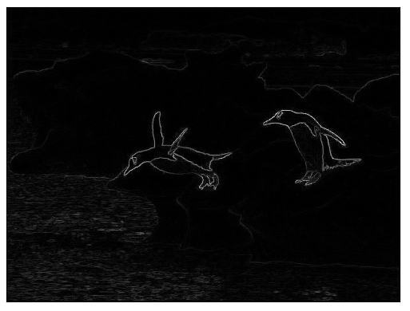
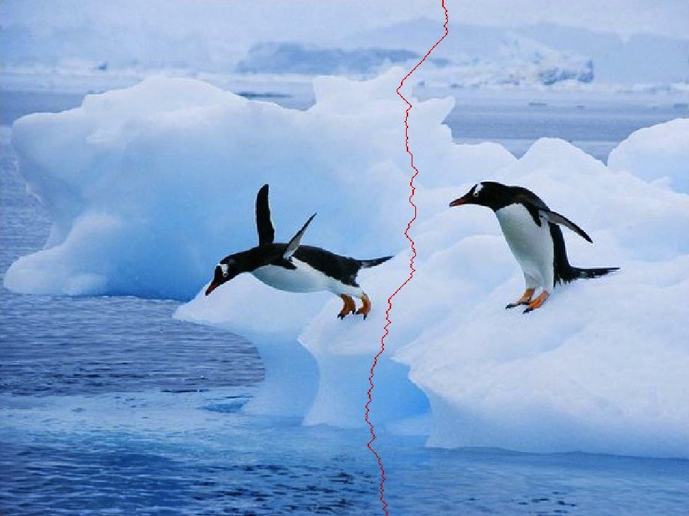
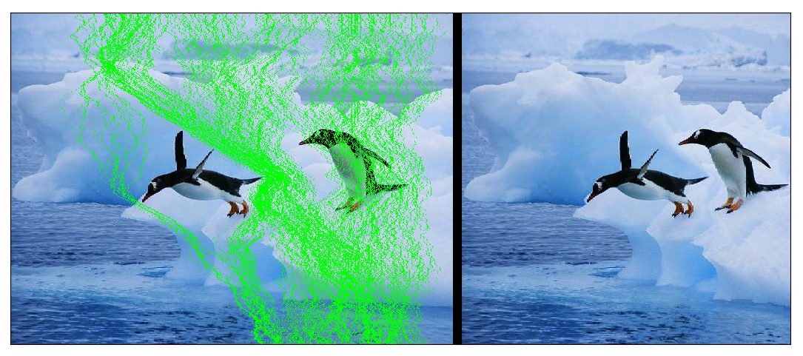
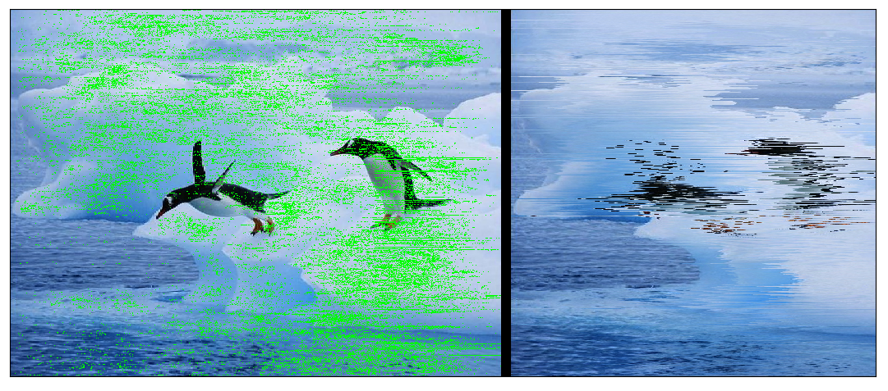

با کتابخانه‌ی OpenCV کارهای زیادی می‌شود کرد. از عملیات اولیه‌ی کار با تصویر گرفته تا یادگیری ماشین. در این پست -- که دیگر پست میانی یک تریلوژی نخواهد بود! -- نحوه‌ی استفاده از OpenCV برای کاهش اندازه‌های یک تصویر با حذف کمترین میزان داده را مرور خواهم کرد. به این کار در ادبیات پردازش تصویر، seam carving می‌گویند.

ما می‌خواهیم طی این پست، همین بلا را سر این عکس از پنگوئن‌ها بیاوریم:


چشم انسان به تغییرات درون تصویر حساس است. به عبارت دیگر نگهداری داده‌های درون تصویر، نگهداری بخش‌هایی از تصویر است که مشتق آن‌ها بزرگتر از بقیه‌ی نقاط باشد:
$$$
D(X)=|S_x*X|+|S_y*X|
$$$
عملگر $*$ نماینده‌ی کانولوشن و $S_x$ و $S_y$ کرنل مشتق سوبل در راستای افقی و عمودی هستند:
$$$
S_x=\left[\begin{array}{ccc}
-1 & 0 & 1\\
-2 & 0 & 2\\
-1 & 0 & 1
\end{array}\right],
S_y=\left[\begin{array}{ccc}
-1 & -2 & -1\\
0 & 0 & 0\\
1 & 2 & 1
\end{array}\right]
$$$

اسم خروجی تابع $D$ در عملیات seam carving، ماتریس انرژی است. بنابراین اولین قدم برای انجام عملیات seam carving، نوشتن تابع $D$ یا تابع محاسبه‌ی انرژی است:
```c++
cv::Mat computeEnergyMatrix(const cv::Mat& _image)
{
    cv::Mat sobelX, sobelY;
    cv::Sobel(_image, sobelX, CV_32F, 1, 0);
    cv::Sobel(_image, sobelY, CV_32F, 0, 1);
    cv::Mat energyMatrix = cv::abs(sobelX) + cv::abs(sobelY);
    cv::transform(energyMatrix, energyMatrix, cv::Matx13f(1,1,1));
    return energyMatrix;
}
```

تابع transform در OpenCV برای انجام عملیات روی کانال‌های تصویر در نظر گرفته شده است که در اینجا من از آن برای جمع زدن مقادیر کانال‌های نتیجه‌ی مشتق‌گیری استفاده کردم.

وقتی این تابع را روی یک تصویر ورودی اعمال کنیم، به هر نقطه‌ی تصویر وزنی اختصاص می‌دهد که نشان‌دهنده‌ی نرم ۱ مشتق تصویر در آن نقطه است. با محاسبه‌ی ماتریس انرژی، ما برای هر نقطه‌ی تصویر یک وزن اهمیت در نظر گرفته‌ایم.


خب، حالا فرض کنیم که می‌خواهیم فقط عرض تصویر را کاهش دهیم. برای اینکار باید تعدادی از ستون‌های تصویر را حذف کنیم. اما مقادیر اهمیت نقاط درون یک ستون از تصویر، همگی یکسان نیستند. پس بهتر است بجای حذف تعدادی ستون، مسیرهایی از بالای تصویر تا پایین آن را پیدا کنیم که مجموع اهمیت‌شان کمترین باشد و آن‌ها را حذف کنیم:


اگر خیلی اهل دقت در کارها باشید حتماً این سؤال برایتان پیش آمده که «خب چرا از هر سطر، نقطه‌ای که کمترین مقدار اهمیت را دارد انتخاب و سپس حذف نکنیم؟» سؤال خوبی است. خیلی خوب است که کد مربوط به این کار را نوشته و خروجی آن را مشاهده کنید. جواب این سؤال را در انتهای این پست می‌نویسم که فرصت برای پیاده‌سازی خودتان و آزمایش آن از دست نرود (می‌توانید کدهای مربوط به این پست را از آدرس https://gitlab.com/vedadian_samples/fun-with-opencv-2.git برداشته و تغییر دهید.)

اما برای یافتن مسیر عمودی با کمترین مجموع انرژی  چه باید کرد؟ محاسبه‌ی ساده‌ی انرژی همه‌ی مسیرهای عمودی درون یک تصویر کاری غیر عملی است. منظورم این است که زمان اجرای برنامه‌ای که برای این کار نوشته شده باشد، آن‌قدر زیاد می‌شود که عملاً از استفاده از آن کد صرف‌نظر خواهد شد. به همین دلیل از روش «برنامه‌ریزی دینامیک» استفاده می‌کنیم. اگر با این روش حل مسأله آشنا نیستید، [صفحه‌ی ویکیپدیای آن](https://en.wikipedia.org/wiki/Dynamic_programming) توضیحات خوبی را ارائه کرده است.

نتیجه‌ی اعمال روش «برنامه‌ریزی دینامیک» این می‌شود که با شروع از سطر دوم ماتریس تصویر، فرض می‌کنیم مقادیر انرژی بهترین مسیر عمودی طی شده تا سطر پیشین را در هر نقطه داریم. با داشتن این مقدار برای هر نقطه در سطر جدید، مقادیر انرژی مسیر تا نقاط همسایه را در نظر می‌گیریم و کمترین مقدار را با انرژی این نقطه جمع می‌زنیم. بدیهی است که این مقدار مربوط به بهترین مسیر عمودی طی شده تا این نقطه خواهد بود. با همین فرمان می‌توانیم تا آخرین سطر ماتریس تصویر پیش برویم. چیزی که باقی مانده، انرژی بهترین مسیر برای نقاط مربوط به سطر اول است. اما مسیرهای مربوط به نقاط سطر اول، خود همان نقاط سطر اول هستند؛ چون پیش از آن نقاط سطر دیگری وجود نداشته است!

خلاصه اینکه قطعه کد زیر با داشتن ماتریس اهمیت یا انرژی نقاط، مسیر عمودی با کمترین انرژی را پیدا کرده و بر می‌گرداند:
```c++
#define MAX_DEVIATION   2
std::vector<int> findVerticalSeam(const cv::Mat& _energyMatrix)
{
    int m = _energyMatrix.rows, n = _energyMatrix.cols;

    cv::Mat pathEnergy = cv::Mat::zeros(cv::Size(n, m), CV_32FC1) + std::numeric_limits<float>::max();
    _energyMatrix(cv::Rect(0, 0, n, 1)).copyTo(pathEnergy(cv::Rect(0, 0, n, 1)));
    cv::Mat offsets = cv::Mat::zeros(cv::Size(n, m), CV_32SC1);
    for(int i = 1; i < m; ++i) {
        for(int j = 0; j < n; ++j) {
            for(int o = -1; o <= 1; ++o) {
                if(j + o >= 0 && j + o < n) {
                    float offsetCost = pathEnergy.at<float>(i - 1, j + o) + _energyMatrix.at<float>(i, j);
                    if(pathEnergy.at<float>(i, j) > offsetCost) {
                        pathEnergy.at<float>(i, j) = offsetCost;
                        offsets.at<int>(i, j) = o;
                    }
                }
            }
        }
    }
    std::vector<int> seam(m);
    seam[m - 1] = 0;
    for(int i = 1; i < n; ++i)
        if(pathEnergy.at<float>(m - 1, i) < pathEnergy.at<float>(m - 1, seam[m - 1]))
            seam[m - 1] = i;
    for(int i = m - 1; i > 0; --i)
        seam[i - 1] = seam[i] + offsets.at<int>(i, seam[i]);
    return seam;
}
```
باید این را اول می‌گفتم، ولی دیر گفتن بهتر از هرگز نگفتن است. یک مسیر عمودی از سطر اول تصویر تا پایین آن، مجموعه‌ی نقاطی است که به ترتیب از سطر اول شروع شده و به انتها می‌رسند، در عین حال هر دو نقطه‌ی مجاور در مسیر، همسایه‌ی هم هستند. مقدار MAX_DEVIATION در قطعه کد بالا، اندازه‌ی همسایگی را تعیین می‌کند. مقدار ۲ که در نظر گرفته شده یعنی هر نقطه در تصویر در یک همسایگی با ابعاد ۵ در ۵ قرار دارد (هرنقطه با ۲ نقطه دورتر از خود در جهت‌های بالا و پایین و چپ و راست همسایه است.)

این دو بخش مسأله که حل شوند، کل مسأله حل شده است. کافیست که در یک حلقه شروع به یافتن seamها و حذف کردنشان بکنیم. این کار را آنقدر انجام دهیم که اندازه‌ی تصویر به میزان دلخواه کاهش یابد:
```c++
for(int i = 0; i < 250; ++i) {
    auto energyMatrix = computeEnergyMatrix(image);
    auto seam = findVerticalSeam(energyMatrix);
    image = removeVerticalSeam(image, seam);
    std::cout << (i + 1) << " seam(s) removed." << std::endl;
}
```
مثلاً در حلقه‌ی بالا، ۲۵۰ ستون از عرض تصویر کاهش پیدا می‌کند.

حالا برای تصویر پنگوئن‌ها که بالاتر آمده، همین کار را انجام می‌دهیم. نتیجه‌اش را می‌توانید در زیر ببینید:


اما جواب سؤالی که قرار بود در انتهای این پست بیاید. جواب این است که چشم ما علاوه بر میزان تغییرات به همسایگی‌های درون تصویر هم حساسیت نشان می‌دهد. مثلاً یک انسان چشم و گوش و بینی دارد که چشم‌هایش در دو سوی بینی و گوش‌ها در دو سوی سر قرار دارند. اگر این ترتیب به هم بریزد، تصویری که بدست می‌آید تصویر یک انسان نیست. بنابراین تصویر زیر یک کاهش اندازه‌ی به درد بخور نیست:


همانطور که اشاره کردم، پیاده‌سازی‌های seam carving به زبان‌های پایتون و c++‎ در آدرس گیت https://gitlab.com/vedadian_samples/fun-with-opencv-2.git در دسترس هستند.