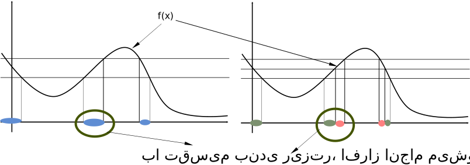

**پیش‌نوشت:** قبل از شروع بخش دوم این سری پُست‌ها، لازم است اعتراف کنم که *مثال‌های کاربردی* سنجه‌ها از جنس مثال‌های کاربردی الگوریتم‌ها نیستند. سنجه‌ها میزانی از انتزاع ریاضی است که باعث شده بررسی دقیق و استوار انتگرال گیری و علی‌الخصوص نظریه‌ی احتمالات، ممکن شود. به همین جهت کاربرد آن‌ها هم از جنس روشن‌سازی و توسعه‌ی افق دید است. منظورم این است که با استفاده از این انتزاع می‌توانیم برخی مسایل را از زاویه‌ی دیگری ببینیم که حل کردنشان را ساده‌تر -- و یا حتی ممکن -- کند.

**اصل مطلب:** دیدیم که بعد از تغییر زاویه‌ی دید انتگرال‌گیری از تقسیم دامنه به تقسیم برد تابع، حقّه‌ی «سنجه» می‌تواند علاوه بر خوش تعریف کردن انتگرال‌های روی بخش‌های نامحدود دامنه، محاسبه‌ی انتگرال‌های جدیدی را هم ممکن کند. خب، باید «سنجه‌ها» را جدّی‌تر بگیریم، پس.

سنجه‌ها توابعی هستند که به عنوان ورودی مجموعه می‌گیرند و یک عدد مثبت حقیقی به عنوان خروجی می‌دهند. این یعنی دامنه‌ی سنجه‌ها، مجموعه‌ای از مجموعه‌ها است. به همین جهت بد نیست دامنه‌ی این توابع را بهتر بشناسیم.

## سیگماجبرها
برای تنوع هم که شده، این بخش را با تعاریف خشک ریاضی شروع می‌کنم.

**تعریف** فرض کنید $D$ یک مجموعه و $2^D$ مجموعه‌ی توانی آن (مجموعه‌ی همه‌ی زیر مجموعه‌های $D$) باشد. هر زیر مجموعه $\Sigma\subseteq 2^D$ که سه شرط زیر را داشته باشد، یک سیگماجبر است:
1. $D$ درون $\Sigma$ باشد: $D\in\Sigma$
2. $\Sigma$ تحت عمل «متمم» گیری بسته باشد: $A\in\Sigma\Rightarrow D-A\in\Sigma$
3. $\Sigma$ تحت عمل «اجتماع شمارا» بسته باشد: $A_1,A_2,A_3,\ldots\in\Sigma\Rightarrow \cup_{i=1}^\infty A_i\in\Sigma$

حالا این به ما چه ربطی دارد؟

برای اینکه بتوانیم روی یک‌سری زیر مجموعه سنجه تعریف کنیم، باید این «یک سری زیر مجموعه» خواص خوبی داشته باشند. یادتان که نرفته، وقتی برد تابع را تقسیم کنیم، یک زیر مجموعه‌ی یکتا از دامنه‌ی تابع وجود دارد که مقدار تابع به ازای نقاط درون آن، در محدوده‌ی مورد نظر ماست.

خواص لیست شده را یکبار دیگر نگاه کنید. اولاً کل دامنه باید در سیگماجبر باشد؛ چون سنجه‌ها باید بتوانند کل دامنه‌ی مورد نظر ما را اندازه گیری کنند. ثانیاً نسبت به متمم گیری بسته است؛ زیرا سنجه‌ها باید بتوانند افراض‌های دامنه را اندازه گیری کنند. ثالثاً نسبت به اجتماع شمارا بسته است؛ زیرا سنجه‌ها باید عملکرد یکنواختی روی اجتماع شمارا تکه از دامنه داشته باشند. فرض کنید سنجه‌ها می‌توانستند یک سری از زیرمجموعه‌های دامنه را اندازه بگیرند، ولی نمی‌توانستند اجتماع آن‌ها را اندازه بگیرند، مسخره نمی‌شد؟ انتگرال گیری روی بخش‌هایی از دامنه چه بلایی سرش می‌آمد؟

خب پس دامنه‌ی مناسب سنجه‌ها، سیگماجبرها هستند. از همینجاست که سؤال‌هایی از این دست که «احتمال بی‌نهایت نقطه‌ی شمارا از مقادیر $X$ اگر $X$ چکالی گوسی داشته باشد، چه می‌شود؟» سالبه به انتفاع موضوع می‌شوند.

جواب اینگونه سؤال‌ها می‌شود اینکه، ما کاری با این نوع زیر مجموعه‌ها نداریم. اینها درون سیگماجبر ما نیستند و برای همین قابل سنجیدن هم نیستند!

# تعریف سنجه
باز هم با تعاریف خشک و دقیق ریاضی شروع می‌کنم:

**تعریف** فرض کنید $X$ یک مجموعه و $\Sigma$ یک سیگماجبر بر روی $X$ باشد. تابع $\mu$ از $\Sigma$ به $R\cup \{-\infty, \infty\}$ را یک سنجه می‌نامیم اگر:
1. برد آن فقط شامل مقادیر مثبت و صفر باشد: $\forall E\subseteq X\Rightarrow \mu(E) \ge 0$
2. مقدار خروجی آن برای مجموعه‌ی تهی صفر باشد: $\mu(\emptyset)=0$
3. روی شمارا زیر مجموعه از $X$ جمع‌پذیر باشد: $\mu\left(\cup_{i=0}^\infty E_i\right)=\sum_{i=0}^\infty \mu(E_i)$

می‌بینید، دوباره اثر سیگماجبر را می‌شود حس کرد. مخصوصاً در مورد شرط سوم. اگر سیگماجبر نسبت به شمارا اجتماع بسته نباشد، دیگر نمی‌شود چنین چیزی را به عنوان شرط سنجه بودن تعریف کرد؛ چون حاصل اجتماع لزوماً جزو دامنه نمی‌شود که سنجه برای آن مقدار داشته باشد، چه رسد به اینکه رابطه‌ای هم بین این مقدار و جمع مقادیر اندازه‌های هر کدام از مجموعه‌ها وجود داشته باشد.

اگر در پاراگراف قبل دقت کرده باشید، متوجه شده‌اید که مقدار خروجی سنجه برای یک مجموعه را اندازه نامیدم. در واقع در فارسی به «نظریه‌ی سنجه‌ها» نظریه‌ی اندازه‌ها می‌گویند که اسم بدی هم نیست؛ اما به نظر من سنجه برای تابعی که اندازه‌ی یک مجموعه را «می‌سنجد» اسم مناسب‌تری است. با این وجود خروجی تابع سنجه، اندازه‌ی مجموعه‌ی ورودی است و من همین نامگذاری را در ادامه هم رعایت خواهم کرد.

حالا بیایید شروط سنجه بودن را خودمانی‌تر نگاه کنیم. اول اینکه برد تابع فقط اعداد مثبت، صفر و بی‌نهایت است. علت این شرط باید از شهودی که برای انتگرال‌گیری مطرح شد، مشخص باشد. مساحت یک مستطیل، حالا هر طور اضلاعش را اندازه بگیرید، نمی‌تواند منفی باشد! شرط دوم هم به همین ترتیب شفاف است. مجموعه‌ای که هیچ عضوی ندارد اندازه‌اش صفر است. اگر باز هم به انتگرال‌گیری برگردیم، اگر به ازای یک بازه از مقادیر، مقدار تابع در هیچ زیربخشی از دامنه در آن قرار نگیرد، سطح زیر منحنی هم برای آن بازه از مقادیر وجود خارجی ندارد:

اما شرط سوم. اگر این شرط سازگاری وجود نداشته باشد، مقدار انتگرال‌گیری برای دقت‌های مختلف متفاوت می‌شود. یادتان که هست، برد تابع را تقسیم می‌کردیم و این تقسیم‌ها را ریز و ریزتر می‌کردیم و حدِّ آن می‌شد مقدار انتگرال. اگر اندازه‌ی اجتماع چند مجموعه با مجموع اندازه‌های آن‌ها یکی نباشد، اصولاً تضمینی برای وجود حد نخواهیم داشت. شهودی هم که نگاه کنیم، اندازه‌گیری انسانی هم اجتماع دو مجموعه را همین طوری محاسبه می‌کند.

پس سنجه‌ها چیزهای عجیبی نیستند. مشاهدات دقیق یک ریاضیدان هستند، از نحوه‌ی برخورد ما با اندازه‌گیری. اما خاصیت ریاضیدان این است که سعی می‌کند انتزاغ کند. یعنی وقتی یک قاعده را یاد گرفت، در ده‌جای دیگر هم از آن استفاده کند. سنجه‌ها هم همین طورند. وقتی تعریف خوبی از سنجه داشته باشیم، می‌توانیم مسائلی را بررسی کنیم که سنجه‌هایشان را قبلاً نمی‌شناختیم.

حالا وقت آن است که یک مثال از استفاده از این انتزاع را بررسی کنیم.

# مثال
بیایید به محاسبه‌ی امید ریاضی، نگاه دیگری بیندازیم. تابعی مثل $f$ داریم که یک توزیع احتمال روی دامنه‌ی آن تعریف شده. مثلاً تابع $f$ می‌تواند میزان خرابی حاصل از وجود ناخالصی در مواد اولیه تولید IC باشد. ناخالصی را هم با میلی‌گرم در لیتر می‌سنجیم. فرض کنیم احتمال وجود مقدار خاصی ناخالصی در مواد اولیه، توزیع گوسی داشته باشد (این فرض، فرض کاملاً معقولی است؛ به قضیه‌ی [حد مرکزی](https://en.wikipedia.org/wiki/Central_limit_theorem) مراجعه کنید.)

حالا می‌خواهیم بدانیم بصورت متوسط چه میزان خرابی در ICهای تولیدی خواهیم داشت. برای محاسبه‌ی این مقدار باید امید ریاضی بگیریم:
$$$
l=\mathbb{E}f(X)=\int f(X)dP(X)
$$$
یک راه محاسبه‌ی عددی یا فرمولی است. راه دیگر این است که تعدادی نمونه از توزیع $P$ درست کنیم. مثلاً ۱۰۰ تا؛ $X_0,\ldots,X_99$. چون این نمونه‌ها از سنجه‌ی $P$ تولید شده اند، تراکمشان هم متناسب با همان سنجه است. به همین خاطر می‌توانیم مقدار خرابی را اینطوری تخمین بزنیم:
$$$
l=\mathbb{E}f(X)\approx \sum_{i=0}^{99} f(X_i)
$$$
در مسأله‌ی این مثال، محاسبه به این روش خیلی جذاب نیست. اما فرض کنید که توزیع مقدار ناخالصی در مواد اولیه را نداشته باشیم و فقط مقداری اندازه‌گیری از ناخالصی‌های روزهای گذشته در دسترس باشد. حالا دیگر مسأله فرق می‌کند.

اگر با فیلتر کالمن آشنا باشید، باید بگویم که نسخه‌ای از این فیلتر برای توزیع‌های ناشناخته وجود دارد که بر همین اساس کار می‌کند و به آن [فیلتر ذرات](https://en.wikipedia.org/wiki/Particle_filter) می‌گویند.

اسم این روش انتگرال‌گیری که معرفی کردم هم [انتگرال گیری مونته‌کارلو](https://en.wikipedia.org/wiki/Monte_Carlo_integration) است.