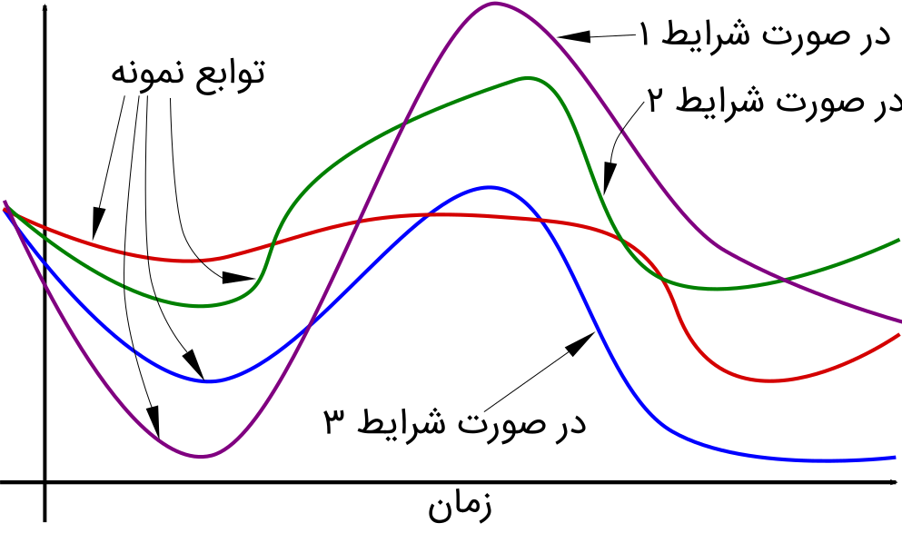

فرایندهای تصادفی را دانشجویان رشته‌های زیادی می‌شناسند. مهندسی برق، هوش مصنوعی، مهندسی هوافضا، اقتصاد و مانند اینها. همه‌ی توابعی که مقادیر آن‌ها از منظر نگاه ما اعدادی تصادفی هستند، در مجموعه‌ی فرایندهای تصادفی قرار می‌گیرند. مقادیر یک سیگنال الکترومغناطیسی که به گوشی موبایل می‌رسد، ارزش سهام یک شرکت در طول زمان، میزان جابجایی یک جزء در یک سیستم مکانیکی، همگی فرایندهای تصادفی هستند.

فرایندهای تصادفی را هم می‌توان مانند انتگرال در یک چهارچوب غیر دقیق مطالعه کرد؛ اما مطالعه‌ی آن‌ها در چهارچوب نظریه‌ی سنجه‌ها، استوارتر است و دیدگاه‌های بهتری را برای مطالعه کننده به ارمغان می‌آورد (دمش گرم!)

حالا بیایید یک مسأله را که به همین فرایندهای تصادفی مربوط می‌شود بررسی کنیم. فرض کنید که می‌خواهیم انتگرال یک تابع $f$ را در بازه‌ای خاص (مثلاً ۰ تا ۱) محاسبه کنیم، اما خود تابع را نداریم. چیزی که در دست داریم نمونه‌هایی از مقادیر $f$ است که توانسته‌ایم اندازه‌گیری کنیم. این مسأله کاملاً کاربردی است. ما در مورد توابعی که با آن‌ها سر و کار داریم، معمولاً اطلاعات کامل نداریم و فقط اندازه‌گیری‌های محدودی از آن‌ها در دسترس ماست.

یکی از راه حل‌های اولیه و مفید، وصل کردن نقاطی که در دسترس داریم با خط راست است. به این ترتیب یک تابع تکه‌-تکه خطی داریم که می‌توانیم انتگرالش را محاسبه کنیم. یا یک منحنی درجه دوم از هر سه نقطه بگذرانیم و اینطوری تقریب بزنیم. بسیاری از این روش‌ها را در محاسبات عددی در دوره‌ی کارشناسی به دانشجویان می‌گویند.

اما اگر اطلاعاتی راجع به تابع $f$ داشته باشیم که احتمالاتی باشند چه؟ آیا می‌توانیم از آن‌ها در بازسازی تابع یا انتگرال‌گیری از تابع استفاده کنیم؟ اصولاً اطلاعات احتمالاتی راجع به توابع یعنی چه؟

اینجاست که سنجه‌ها سروکله‌یشان پیدا می‌شود. با ابزارهای رایج به راحتی نمی‌شود یک مجموعه از توابع را اندازه گیری کرد (مثلاً احتمال به آن‌ها تخصیص داد.)

**اخطار** مسأله‌ی مطرح شده در بالا (انتگرال‌گیری از تابع نامشخص) اینجا در دستور کار نیست. از این به بعد، بحث سنجه‌ها روی مجموعه‌ی توابع مدنظر است و خصوصاً سنجه‌ی وینر را که قانون احتمال فرایند وینر است، بررسی می‌کنیم.

## سنجه‌ی وینر
آقای [وینر](https://en.wikipedia.org/wiki/Norbert_Wiener) که معرف حضور هستند. فیلتر وینر به احترام ایشان نامگذاری شده است. آقای وینر یک ریاضیدان و فیلسوف امریکایی است که در MIT استاد بوده است. ایشان جزو اولین نفراتی است که سعی کردند خواص توابع نمونه‌ی فرایندهای تصادفی را هم بررسی کنند. اگر از اسمش مشخص نیست، توابع نمونه‌ی یک فرایند تصادفی توابعی هستند که اگر وضعیت رخدادهایی که باعث شده یک فرایند تصادفی شود را دقیقاً بدانیم -- جای خدا بنشینیم! -- با آن‌ها برخورد می‌کنیم. مثلاً اگر من وضعیت یک کانال مخابراتی -- مثل فضای شهری -- را دقیقاً بدانم، سیگنال الکترومغناطیسی دریافتی موبایل برایم یک تابع ساده از زمان می‌شود. خودمانیم لازم نیست جای خدا بنشینیم، همین موبایل‌های ما هم عملاً با توابع نمونه سر و کار دارند. سیگنالی که به موبایل می‌رسد از پیش برای ما مشخص نیست؛ ولی وقتی به موبایل می‌رسد مقادیر مشخصی دارد، بنابراین یک تابع نمونه است.

یافتن خواص توابع نمونه‌ی یک فرایند تصادفی مسأله‌ی بسیار جذابی است. آقای وینر برای احتمال رخداد مجموعه‌هایی از این توابع یک سنجه‌ی گوسی پیشنهاد کرد.

اگر تا اینجا را با هم درست پیش آمده باشیم، باید بپرسید، خب این سنجه روی چه سیمگافیلدی تعریف شده است؟ فرض کنید که می‌دانیم توابع مد نظر ما در زمان‌های $t_0$، $t_1$ و همینطور تا $t_n$ مقادیرشان در بازه‌های خاصی است. مثلاً در زمان $t_0$ مقدار توابع مورد نظر ما در بازه‌ی $(5,10)$ قرار دارد، در زمان $t_1$ در بازه‌ی $(8,11)$ و ... . برای این بازه‌ها هم اسامی $A_0$ تا $A_n$ را در نظر می‌گیریم. با داشتن این دانسته‌ها، عملاً یک زیرمجموعه از توابع نمونه‌ی فرایند تصادفی را توصیف کرده‌ایم. در میان همه‌ی توابع نمونه، آن‌هایی که در زمان‌های مشخص، مقادیری در بازه‌های مشخص اختیار می‌کنند. برای سهولت کار بیایید روی این زیر مجموعه یک اسم بگذاریم:
$$$
C(t_0,\ldots,t_n;A_0,\ldots,A_n)
$$$
حالا برای این زیر مجموعه‌ها مقدار سنجه را تعریف می‌کنیم:
$$$
\begin{array}{l}
&&\mu\left(C(t_0,\ldots,t_n;A_0,\ldots,A_n)\right)=\\
&&\int_{A_0}\int_{A_1}\cdots\int_{A_n}p(t_n-t_{n-1},x_n-x_{n-1})\ldots p(t_0,x_0)dx_ndx_{n-1}\ldots dx_0
\end{array}
$$$
تابع $p$ هم همان فرم گوسی یعنی $p(a,b)=(4\pi a)^{-n/2}e^{-\mid b\mid^2/4t}$ است.

با در دست داشتن این سنجه می‌توانیم کارهای جالبی انجام دهیم. مثلاً امید ریاضی توان دوم توابعی که توزیع احتمالاتی وینر دارند چه تابعی است؟ دقت کنید که زیر مجموعه‌ی خاصی را مشخص نکرده‌ایم پس نه مقادیر $t_i$ داریم و نه بازه‌ی محدود $A_i$:
$$$
\mathbb{E}(|\omega(t)|^2)=\int p(t,x)|x|^2dx=2nt
$$$

پس امید ریاضی اندازه‌ی تابع نمونه‌ی فرایندی با این قانون می‌شود $\sqrt{2nt}$.

به فرایندی که قانون احتمال آن سنجه‌ی وینر باشد، فرایند وینر می‌گویند (بدیهی نیست؟)

فرایند وینر در ریاضیات مالی و فیزیک، کاربردهای گسترده‌ای دارد.

## خاتمه‌ی کلام
به نظر می‌آید که بدون اینکه عمدی داشته باشم، علاقه‌ی خاصی به تریلوژی پیدا کرده‌ام. به هر حال به نظر من صحبت پیوسته در مورد سنجه‌ها بیشتر از این در حوصله‌ی روزنوشته‌های مثل منی نیست. غرض از این این سلسله‌ی پُست‌ها این بود که کنجکاوی و علاقه‌ی خواننده‌ی احتمالی را به مباحث پایه‌ی تئوری احتمالات جدید، بیشتر کنم. یک مثال کاربردی از فواید تغییر نگرش به این سبک ارائه دهم و در نهایت یک مسأله‌ی پیشرفته‌تر از احتمالات عادی را بررسی کنم که این هم خودش در راستای انگیزاندن برای مطالعه‌ی بیشتر در همین زمینه بوده و عملاً بخشی از هدف اول است.

**عذرخواهی** در نسخه‌ی اول پُست اول این مجموعه، عکس‌هایی که گذاشته بودم، غلط بودند. در واقع عمل انتگرال‌گیری را که به درستی تشریح شده بود، به اشتباه نشان می‌دادند. این عکس‌ها به محض انتشار پُست دوم اصلاح شدند.