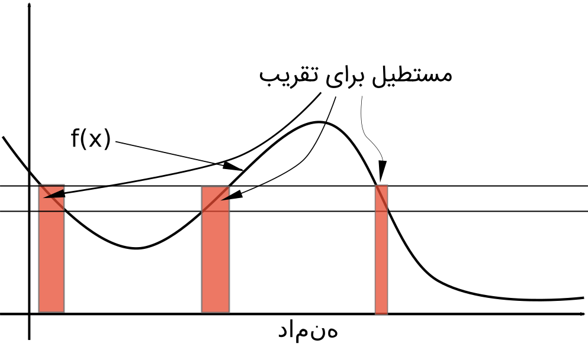
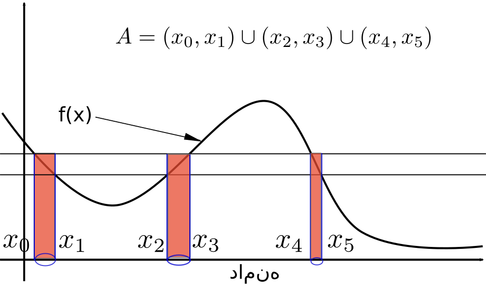

اگر دانشجوی تحصیلات تکمیلی در رشته‌های فنی و یا ریاضی هستید و یا بوده‌اید، حتماً با انتگرال‌هایی به فرم
$$$
\int_D f(x)d\mu(x)
$$$
بر خورد کرده‌اید. مخصوصاً اگر به آمار و احتمال در مقالات جدی و جدید رسیده باشید که احتمال بالایی هم دارد.

اولین باری که من به این نوع از انتگرال‌ها برخورد کردم، دوران کارشناسی ارشد در دانشکده‌ی برق دانشگاه امیر کبیر بود. از همان سال اول وقتی مقالات کسانی مثل [توماس کایلاس](https://en.wikipedia.org/wiki/Thomas_Kailath) بزرگ و یا [سیمون هیکین](https://en.wikipedia.org/wiki/Simon_Haykin) را می‌خواندم، این انتگرال‌ها برایم عجیب بود و دوست‌داشتنی. خب راستش حتماً از وجنات و نوشته‌های من علاقه‌ی افراطی به ریاضیات هویداست؛ ولی حتی اگر این علاقه هم نبود، باز هم دیدن این انتگرال‌ها، حس کنجکاوی من را بر می‌انگیخت. در هوش مصنوعی هم کتاب خواندنی «[نظریه‌ی یادگیری آماری](http://eu.wiley.com/WileyCDA/WileyTitle/productCd-0471030031.html)» استاد وپ‌نیک از این دست انتگرال‌ها زیاد دارد.

ظاهراً روش جدید برخورد با انتگرال‌ها در آخرین سال‌های قرن نوزدهم توسط [امیل بورل](https://en.wikipedia.org/wiki/%C3%89mile_Borel) -- ریاضی‌دان بزرگ فرانسوی -- کلید خورده است. نظریه‌ای که پس از آن توسط [هانری لبگ](https://en.wikipedia.org/wiki/Henri_Lebesgue) -- دیگر ریاضی‌دان بزرگ فرانسوی -- توسعه پیدا کرد و پایه‌های آنالیز ریاضی را تکان داد.

از این تاریخ‌نگاری مختصر که بگذریم، اولین چیزی که می‌خواهم در این ارتباط بگویم، این است که چرا وقتی انتگرال‌های ریمان و اسلاف آن را می‌شناسیم و در دبیرستان و سال اول دانشگاه آن‌ها را یاد گرفته‌ایم، باید خودمان را درگیر شناخت نوع دیگری از انتگرال کنیم؟

جواب اول سؤال بالا این است که لازم نیست! کسی که با دانسته‌های امروزش دارد به خوبی زندگی می‌کند و برای هیجان زندگی خودش در حوزه‌ها و زمینه‌های دیگر دست به اکتشاف و جستجو می‌زند، این کار اتلاف منابع است. اما اگر -- همانطور که در بالا اشاره کردم -- با این انتگرال‌ها در زمینه‌ی کاری و یا علائق خودتان سر و کار دارید، جواب این است که نوع جدید انتگرال‌ها، آنالیز ریاضی را کلّی بهتر کرده‌اند. نظریه‌ی احتمالات را متحول کرده‌اند. آخرش هم اینکه از طریق ایجاد انتزاع بیشتر، مطالعه‌ی موضوعات جدیدی را ممکن کرده‌اند.

مسلّم است که در جایی مثل روزنوشته‌های من، فرصت و امکان بررسی دقیق این نظریه وجود ندارد. قصد من این است که در این پُست و پُست‌هایی در ادامه‌ی آن، تا حدودی موضوع را از منظری کلی باز کنم و حس کنجکاوی بیشتری ایجاد کنم.

## چشم‌ها را باید شست
از دبیرستان خاطرمان هست که وقتی می‌خواستیم سطح زیر یک منحنی را که با $f(x)$ مشخص می‌شود حساب کنیم، دامنه‌ی آن را به قطعات خیلی ریز تقسیم می‌کردیم و در هر قطعه، مقدار $f(x)$ را در یک نقطه‌ی دلخواه محاسبه کرده و سطح آن تکه‌ی کوچک از منحنی را با سطح مستطیل کوچکی که تشکیل می‌شد تقریب می‌زدیم

و با کوچک‌تر کردن عرض مستطیل، تقریبمان را بهتر می‌کردیم. حد این تقریب‌ها وقتی تعداد مستطیل‌ها بی‌نهایت باشد، سطح زیر منحنی بود:
$$$
\int f(x)dx=\text{lim}_{n\rightarrow \infty} \sum f(x_i)(x_{i+1}-x_{i})
$$$
اما این کار چندین مشکل دارد. یکی اینکه معتبر بودن این تقریب فقط برای زمانی است که دامنه‌ای که انتگرال روی آن محاسبه می‌شود، محدود باشد. در عمل برای محاسبه‌ی انتگرال‌ها روی دامنه‌های نامحدود، مجبوریم دوباره حد محاسبه‌ی انتگرال محدود را محاسبه کنیم. دوم اینکه وقتی این دامنه‌ی نامحدود، با دامنه‌ی نامحدود دیگری ترکیب شود -- مثلاً وقتی یک انتگرال دوگانه را محاسبه می‌کنیم $\int\int$ -- انواع و اقسام مشکلات فنی برای محاسبه پیش می‌آید.

حالا بیایید جور دیگری نگاه کنیم. اگر بجای تقسیم دامنه، برد تابع را تقسیم کنیم، بعد برای هر تکه از برد تابع، مساحت همه‌ی مستطیل‌هایی که تشکیل می‌شوند را در نظر بگیریم، چه اتفاقی می‌افتد؟

باز هم به لحاظ شهودی، می‌توانیم سطح زیر نمودار را با جمع سطح این مستطیل‌ها حساب کنیم. حقّه‌ای که باعث می‌شود، این روش محاسبه‌ی انتگرال اینقدر متفاوت شود این است که بجای اینکه این مستطیل‌ها را جداگانه در نظر بگیریم، یک «سنجه» در نظر می‌گیریم که بخش‌هایی از دامنه‌ی تابع را که مقادیر تابع در آنجا درون محدوده‌ی مورد نظر ماست، اندازه بگیرد

در مثال شکل ۳، می‌توانیم مساحت همه‌ی مستطیل‌ها را با عبارت زیر محاسبه کنیم:
$$$
\text{area}=y_i\mu(A)
$$$
که در آن $A$ همان زیر مجموعه از دامنه‌ی تابع است که با بیضی‌های آبی جدا شده، $\mu$ تابع سنجه است که اندازه‌ی این زیر مجموعه را می‌سنجد و $y_i$ مقدار تابع در این زیر مجموعه‌ی دامنه است.

همین حقّه‌ی ساده، امکان انجام بسیاری از عملیات‌ها را فراهم می‌کند. باز در مثال شکل ۳، اگر تابع $\mu$ برای $A$ مقدار $\mid x_1-x_0\mid+\mid x_3-x_2\mid+\mid x_5-x_4\mid$ را برگرداند، مقدار انتگرالی که محاسبه می‌کنیم، دقیقاً برابر نسخه‌ی ریمانی آن خواهد بود. ولی این تنها سنجه‌ی کاربردی برای انتگرال‌گیری از تابع $f$ نیست. یک مثال مهم دیگر از سنجه‌های کاربردی، سنجه‌ی توزیع احتمال است.

بیایید فرض کنیم احتمال اینکه ورودی تابع ما -- همان $f$ -- در بازه‌های خاصی باشد، معلوم است. همچنین فرض کنید نام این سنجه را $P$ بگذاریم. به زبان ریاضی چیزی که گفتیم می‌شود:
$$$
P(x\in A)=\mu(A)
$$$
حالا می‌توانیم انتگرال دیگری را محاسبه کنیم. مقدار این انتگرال، امید ریاضی تابع $f$ است. قبلاً برای محاسبه‌ی امید ریاضی تابع $f$، اول تابع چگالی احتمال را بدست می‌آوردیم که برابر $p(x)=\frac{dP}{dx}$ بود؛ بعدش انتگرال زیر را محاسبه می‌کردیم:
$$$
\mathbb{E}(f(x))=\int f(x)p(x)dx
$$$
اما با فرم جدید، می‌توانیم بنویسیم:
$$$
\mathbb{E}(f(x))=\int f(x)dP
$$$
در این فرم، حتی لازم نیست که $P$ مشتق‌پذیر باشد. لازم نیست دامنه‌ی تابع ما، از نوع دامنه‌های خوش‌رفتاری باشد که پیشتر با آن‌ها برخورد داشتیم. مثلاً دامنه‌ی تابع ما می‌تواند خودش مجموعه‌ای از توابع باشد. توابعی که دامنه‌شان خودش یک مجموعه از توابع باشد را در ریاضیات به نام [فانکشنال](https://en.wikipedia.org/wiki/Functional_(mathematics)) می‌شناسیم.

می‌بینید! با یک تغییر نگرش، یک زمینه‌ی جدید برای تحقیق و کاربرد پیدا شد. بررسی فانکشنال‌ها. اگر فکر می‌کنید این‌ها یک مشت انتزاعات غیرکاربردی است که ریاضیدان‌ها سر خودشان را با آن گرم می‌کنند، شما را به همان نام‌هایی که اول این پُست به آن‌ها اشاره کردم ارجاع می‌دهم. وپ‌نیک و کایلاس و هیکین. این‌ها همه‌شان علاوه بر اینکه ریاضیدان‌های خوبی هستند، بیشتر کارشان در حوزه‌ی کاربرد است. دوتای آخری که عملاً مهندس برق بودند و هستند و در حوزه‌ی شناسایی سیگنال کار می‌کرده‌اند. چیزی که باعث شد ما الآن بتوانیم موبایل‌هامان را هر جا که خواستیم از جیبمان در بیاوریم و با کسی که دوستش داریم تماس بگیریم.

اصلاً اگر این‌ها هم نمی‌تواند کاربردی بودن این زمینه از ریاضیات را خوب آشکار کند، یک مثال از این فانکشنال‌ها می‌زنم. تابع آشنای تبدیل فوریه یک فانکشنال است. یادتان که هست، این فانکشنال یک تابع پیوسته و یک مقدار حقیقی می‌گرفت و یک مقدار حقیقی دیگر بر می‌گرداند:
$$$
F(f,\omega)=\int f(x)e^{j\omega x}d\mu(x)
$$$
مقصود از $\mu$ در فرمول بالا سنجه‌ی لبگ است. همانی که برای مجموعه‌ی $A$ در مثال شکل ۳، مقدار $\mid x_1-x_0\mid+\mid x_3-x_2\mid+\mid x_5-x_4\mid$ بر می‌گرداند.

امیدوارم تا اینجا توانسته باشم کنجکاوی لازم برای ادامه‌ی صحبت در مورد نظریه‌ی سنجه و انتگرال را ایجاد کنم. در پُست‌های ادامه، کمی -- فقط کمی -- عمیق‌تر به نظریه‌ی سنجه نگاه می‌کنیم و یکی دو مثال کاربردی را هم بررسی می‌کنیم؛ باشد که برای کسی مفید افتد!