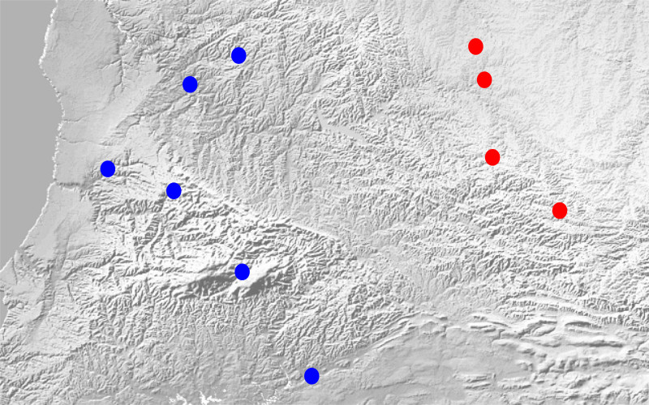
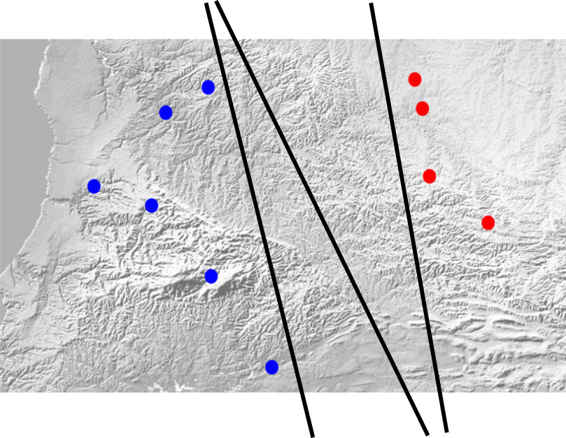
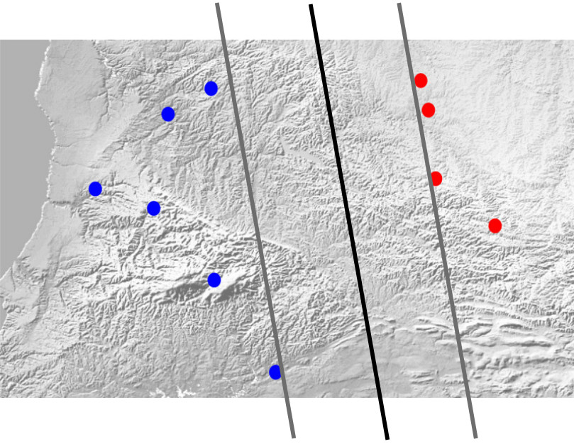
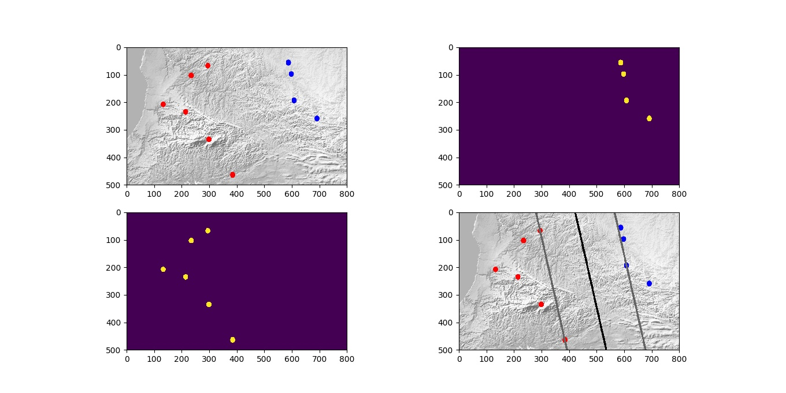

در [قسمت قبلی](/learnable-models-this-understanding-computer-how-does-it-learn) از کامپیوتر و اینکه چطور یاد میگیرد نوشتم. در میانه‌ی آن نوشتار، به دوست ساده و عزیزم خط راست، اشاره کردم. اینکه با وجود توانمندیهای کمش، می‌تواند مفید باشد و کاری کند که کامپیوتر چیزهایی یاد بگیرد.

فکر می‌کنم الآن وقت آن باشد که برای دیدن نتیجه‌ی واقعی یک آموزش ساده با استفاده از این تابع راستکردار، کمی وقت بگذاریم.

فرض کنید افرادی از دو قبیله، در یک منطقه‌ی جغرافیایی برای خودشان خانه درست کرده‌اند. پس از چند وقت سر اینکه چه بخشی از آن منطقه قلمرو هر قبیله است، اختلاف پیش آمده. کامپیوتر ما هم معلوم نیست چطوری سر از آن زمان در آورده که قبایل اینطوری وجود داشته‌اند و با هم درگیری پیدا کرده‌اند.

حالا می‌خواهیم نقاطی را که افراد این دو قبیله آنجا خانه ساخته‌اند به کامپیوترمان نشان دهیم و از آن به بعد کامپیوتر به ما بگوید که هر نقطه روی آن منطقه متعلق به کدام قبیله است. (تو را به خدا از صورت مسأله‌ی من ایراد نگیرید که هرچند مسخره است، کلی فکر کردم که بهش رسیدم!)



بنابراین تعدادی نقطه نماینده‌ی محل خانه‌های افراد قبیله‌ی آبی داریم و تعدادی نقطه نماینده‌ی خانه‌های افراد قبیله‌ی قرمز. خط راست را هم که در پست قبل دیدیم دو پارامتر دارد. یکی نماینده‌ی شیب خط و دیگری عرض از مبدأ آن ($a$ و $b$ در فرمول $y=f(x)=ax+b$.)

در کلاس درس باید مقادیر مناسب $a$ و $b$ یادگیری شود که بیشترین فاصله را از خانه‌های قبیله‌های قرمز و آبی داشته باشد و در عین حال هر قبیله در یک سمت خط مربوط به این پارامترها قرار گرفته باشد.

با یک نگاه به فرمول خط راست ($y-ax-b=0$) می‌توانیم نتیجه‌ی در یک سمت خط راست بودن چند نقطه را حدس بزنیم. اگر مختصات نقاطی که روی خط راست هستند را درون فرمول بگذاریم که مشخص است و عدد صفر بدست می‌آید. اما اگر چند نقطه در یک طرف خط باشند، علامت مقداری که از قرار دادن مختصات آن‌ها در فرمول بدست می‌آید برابر خواهد بود.

پس بیاییم قرار بگذاریم که علامت قبیله‌ی قرمز، منفی و علامت قبیله‌ی آبی مثبت باشد. ظاهراً کارها دارد پیش می‌رود. فقط یک نکته باقی مانده است. خطوط راستی که می‌توانند دو مجموعه نقطه را از هم جدا کنند بیشمارند.



هر کدام از خط‌های سیاهی که در تصویر بالاست می‌تواند یک جواب باشد. البته یک نکته فراموش شده بود! قرار بود این خط بیشترین فاصله را از خانه‌های هر دو قبیله داشته باشد. برای اینکه این شرط آخر محقق شود، بجای یک خط جدا کننده، دو خط جداکننده در نظر می‌گیریم. یکی از آن‌ها تا نزدیکترین نقطه‌ی ممکن قبیله‌ی آبی رفته و دیگری تا نزدیکترین نقطه‌ی قبیله‌ی قرمز و هر دو موازی هستند. این دو خط نماینده‌ی فاصله‌ی تک خط مرزی از هر کدام از قبیله‌هاست. حالا کافیست که فاصله‌ی این دو خط از هم حداکثر باشد. خط جدا کننده‌ی نهایی هم متوسط این دو خط خواهد بود.



چون گفتیم که خطوط پشتیبان موازی‌اند، پس پارامتر $a$ آن‌ها یکسان است. اما عرض از مبدأ یکسانی ندارند. مثلاً عرض از مبدأ یکی از آن‌ها $b_0$ و دیگری $b_1$ است.

مسأله‌ی مورد نظر ما را می‌شود بصورت زیر بیان کرد:
$$$
\begin{array}{l l}
\text{Maximize } \frac{\mid b_0-b_1 \mid}{1+a^2} & \\
\text{subject to} & l_i(y_i-ax_i-0.5(b_0+b_1)) > 0
\end{array}
$$$

مفهوم رابطه‌ی بالا این است که مقدار $\frac{\mid b_0-b_1 \mid}{1+a^2}$ را بیشینه کن در حالی که برای همه‌ی نقاط (چه مربوط به قبیله‌ی قرمز و چه آبی) مقدار علامت آن نقطه (علامت مربوط به قبیله -- $l_i$) ضرب در مقداری که از قرار دادن مختصات نقطه در فرمول خط بدست می‌آید، مقداری مثبت باشد. این یعنی خط به درستی برچسب قبیله را پیش‌بینی کند.

آخ! باز هم یک مشکل دیگر! آنهم برای یک مسأله‌ی ساده مثل این. چیزی که تا اینجا بدست آمده یک مسأله‌ی محدب نیست و جعبه‌ابزارهای بهینه‌سازی نمی‌توانند با تضمین مناسب این مسأله را حل کنند. اما راه حل مسأله چیز دشواری نیست. کافی است فرمول خط راست‌مان را طور دیگری بنویسیم. این را هم در دبیرستان دیده‌ایم:
$$$
ay+bx+c=0
$$$

با این کار یک درجه‌ی آزادی نالازم به فرمول خط اضافه می‌شود. اما همین درجه‌ی آزادی نالازم می‌تواند خیلی از مشکلات را حل کند. برای نمایش خطوط پستیبان، لازم نیست که عرض از مبدأ آن‌ها را در نظر داشته باشیم. اینبار خط اصلی جداکننده را $ay+bx+c=0$ در نظر می‌گیریم و دو خط پشتیبان را بصورت:
$$$
\begin{array}{l}
ay+bx+c-1=0 \Leftarrow y-(-\frac{b}{a})x-(-\frac{c-1}{a})=0\\
ay+bx+c+1=0 \Leftarrow y-(-\frac{b}{a})x-(-\frac{c+1}{a})=0
\end{array}
$$$
دقت کنید هرچند درجه‌ی آزادی به فرمول خط راست اضافه شده، درجات آزادی کل مسأله تغییری نکرده!

حالا مسأله‌ی ما تبدیل می‌شود به:
$$$
\begin{array}{l l}
\text{Maximize } \frac{\mid 2 \mid}{a^2+b^2} & \\
\text{subject to} & l_i(ay_i+bx_i+c) > 0
\end{array}
$$$
با برداشتن یک قدم دیگر به یک مسأله‌ی محدب می‌رسیم، کافیست که فرم تابع هدف معکوس شود:
$$$
\begin{array}{l l}
\text{Minimize } a^2+b^2 & \\
\text{subject to} & l_i(ay_i+bx_i+c) > 0
\end{array}
$$$

ابزارهای بهینه‌سازی موجود این مسأله را به راحتی حل می‌کنند و معما چو حل گشت آسان شود. حالا هربار مشکلی بین قبایل پیش آمد کافیست نقطه‌ی محل مناقشه را به کامپیوتر بدهید تا علامتش را بدست آورد و بگوید مال کدام قبیله است.

برای اینکه علاقه‌مندان به دنبال کردن این مباحث بتوانند در عمل نحوه‌ی دست و پنجه نرم‌کردن با این مسأله را ببینند، یک [برنامه‌ی نمونه](https://gitlab.com/vedadian_samples/straight-line-classification.git) به زبان پایتون نوشته‌ام که اگر تصویر نقشه و قبایل را به آن بدهید، برایتان خط مرزی را پیدا می‌کند.

اگر برنامه را بگیرید و اجرا کنید، نتیجه‌ی زیر را می‌بینید


برای اجرای برنامه نیاز به نصب چند کتابخانه دارید. اولین کتابخانه، کتابخانه‌ی OpenCV برای پایتون است. با فرض اینکه شما روی سیستم عامل اوبونتو -- یا مینت -- زندگی می‌کنید، دستور زیر، این کتابخانه را نصب می‌کند
```bash
sudo apt-get install python-opencv
```

کتابخانه‌های بعدی، `matplotlib`، `numpy`، `cvxopt` و `cvxpy` هستند. همه‌ی اینها را می‌توانید با دستورات زیر نصب کنید
```bash
sudo su
pip install --upgrade pip
pip install --upgrade matplotlib
pip install --upgrade numpy
pip install --upgrade cvxopt
pip install --upgrade cvxpy
```

حالا کافیست برنامه را از git کپی بگیرید و یا از آدرس [گیت‌لب](https://gitlab.com/vedadian_samples/straight-line-classification/repository/archive.zip?ref=master)
دانلود کنید و بعد با دستور زیر آن را اجرا نمایید
```bash
python doit.py
```

درون کد برنامه برای هر بخش یک توضیح مختصر هم گذاشته‌ام که امیدوارم مفید باشد.