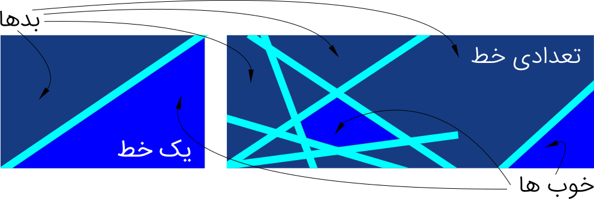

سال ۱۳۷۳ بود که اولین کامپیوتر شخصی خودم را خریدم. درست تر بگویم برایم خریدند. آن موقع‌ها، حافظه‌ی رم دستگاه‌ها در حد و اندازه ۱ مگابایت بود و هوشمندانه ترین کاری که این اختراع دوست داشتنی برای من می‌کرد، گرفتن کلیدها بود و از جا جهاندن علاءالدین از روی ماموران خلیفه.

از آن موقع‌ها تا حالا کامپیوترها خیلی پیشرفت کرده‌اند. اندازه‌شان هم کوچکتر شده است -- درست مثل انسان‌ها. حالا دیگر می‌توانی با گوشی موبایلت حرف بزنی و از او چیزی بخواهی. یا تصویر یک تابلوی راهنما را در کشور غریب به او نشان دهی و از او بخواهی که برایت -- به زبان تو -- بخوانَدَش.

اما مگر می‌شود؟ یک مشت فیلیپ فلاپ نادان و چند ده گرم نیمه‌رسانا یاد بگیرند چگونه ببینند و چگونه بشنوند؟

## توابع ریاضی از منظری دیگر
اولین گونه‌ای از توابع ریاضی که به ما می‌آموزند -- اگر اشتباه نکنم -- خط راست است. تابع $f(x)=ax+b$. لااقل این اولین تابع عملیاتی است که با آن آشنا می‌شویم. تابعی با یک متغیر که نماینده‌ی یک خط صاف در یک صفحه‌ی دو بعدی مانند یک ورق کاغذ است. بسته به اینکه مقادیر $a$ و $b$ چه باشد، محل و شیب خط، عوض می‌شود.

با وجود اینکه یک خط راست به تنهایی کارهای زیادی از دستش بر نمی‌آید، با همین قابلیت‌های اندکش می‌توان کارهای بزرگی کرد. مخصوصاً اگر تعداد قابل توجهی خط را بکار بگیریم. برای مثال با یک خط، می‌توان یک صفحه‌ی دو بعدی را به دو قسمت کاملاً مجزا تقسیم کرد. یک طرف خط «بدها» و طرف دیگر «خوب‌ها»! حالا اگر به اندازه کافی خط داشته باشیم، می‌توانیم یک صفحه را به هر نحوی که دوست داشتیم تقسیم کنیم.

کامپیوترها هم خیلی وقت‌ها به توابع از همین منظر نگاه می‌کنند -- که یکی از آن وقت‌ها هنگام یادگیری است. ما یک تابع کلّی داریم که تعداد زیادی پارامتر دارد. وقتی بهشان آموزش می‌دهی، یاد می‌گیرند که چه مقادیری را برای پارامترهای این توابع در نظر بگیرند. مقادیری که بتواند نتیجه‌ی مورد نظر ما را بهتر تأمین کند. مسلّماً چیزی که می‌خواهیم به «خوب»ها و «بد»ها -- و یا تعداد بیشتری برچسب -- تقسیم کنیم، به سادگی یک صفحه‌ی دو بعدی نیست، اما مکانیزم مورد استفاده همان چیزی است که در مورد تقسیم یک صفحه‌ی دو بعدی وجود دارد.

محققان انواع و اقسام زیادی از این توابع کلّی را طراحی و آزمایش کرده‌اند. شبکه‌های عصبی[>Artificial Neural Network]، ماشین‌های بردار پشتیبان[>Support Vector Machine]، توابع فازی، مدل‌های احتمالاتی گرافی[>Probabilistic Graphical Model] و مانند این‌ها. باز هم تأکید می‌کنم که همه‌ی این‌ها -- از منظر یادگیری ماشین -- توابعی با تعداد زیاد پارامتر هستند. این‌ها مدل‌هایی هستند که در عمل روی فضاهایی با ابعاد بسیار بالا -- در حد ده‌ها و صدها هزار بعد -- کار می‌کنند و تعداد پارمترهاشان خیلی از این مقدار بیشتر هم هست.

## چگونه تابع خود را آموزش دهیم
برای بررسی این موضوع بهتر است به مثال شیرین خط مستقیم برگردیم. تابع $f(x;a,b)=ax+b$. این دفعه ورودی‌های تابع را به دو بخش تقسیم کردم. بخش ورودی یا همان $x$ و بخش پارامترها $a$ و $b$. از منظر ریاضیات و محاسبات، این دو دسته ورودی هیچ تفاوتی ندارند. در عمل هم تفاوتی ندارند. این فقط به ما کمک می‌کند که هنگام طراحی بتوانیم مقادیر درست را به ورودی درست بفرستیم. اگر برنامه‌نویس باشید، حتماً با استانداردهای نام‌گذاری بر خورد کرده‌اید! استفاده‌ی هوشمندانه از این نکته می‌تواند مسأله‌ی آموزش دادن تابع را حل کند.

قبل از پریدن به درون استخر آموزش لازم است که بگویم آموزش دادن به کامپیوتر هم شباهت زیادی به آموزش دادن به انسان دارد. اینجا هم معلم لازم داریم و حجم قابل قبولی داده‌های آموزشی که کامپیوتر ببیند و از روی آن یادبگیرد که چه باید بکند. مثلاً باید یک مجموعه عکس آماده داشته باشیم که درون آن محل‌هایی که نوشته وجود دارد را علامت‌گذاری کرده باشیم. حالا اینها را به کامپیوتر نشان دهیم تا یاد بگیرد در عکس‌های جدید، محل نوشته‌ها را پیدا کند -- شاید سپس بتواند متن نوشته را به زبان ما بخواند.

فرض کنیم مجموعه‌ی آموزشی ما شامل نمونه‌هایی بصورت $D=\left\{(x_1,f_1),(x_2,f_2),\ldots,(x_N,f_N)\right\}$ است. برای آموزش دادن، تابع جدیدی تعریف می‌کنیم که فقط $a$ و $b$ را به عنوان ورودی می‌گیرد. اسمش را هم می‌گذاریم تابع خطا و با $J$ نمایشش می‌دهیم.

$$$
J(a,b)=\sum_{i=1}^N \|f(x_i;a,b)-f_i\|^2
$$$

حالا به کمک معلم مربوطه $a$ و $b$ ای پیدا می‌کنیم که مقدار $J$ برایش کمترین باشد. این یعنی مقادیری که نتیجه‌ی مورد نظر ما را بهتر تأمین کند. اگر به فرم $J$ دقت کنید، تفاوت تابع یادگرفته شده از مقدار مورد نظر ما را محاسبه کرده، به توان ۲ رسانده و این اختلاف را برای همه‌ی نمونه‌هایی که به کامپیوتر نشان داده‌ایم، جمع زده. کوچک بودن مقدار $J$ یعنی، تک تک جملات درون سیگمای جمع کوچک بوده‌اند -- چون همگی اعدادی مثبت‌اند.

و امّا معلم فرهیخته‌ی ما، کسی نیست جز «جعبه‌ابزار بهینه‌سازی». جعبه‌ابزاری که محققان «بهینه‌سازی» در ریاضیات و علوم مهندسی، در اختیار ما قرار داده‌اند. اگر به این مبحث علاقه‌مندید، کتاب [استفان بوید](http://stanford.edu/~boyd/cvxbook/bv_cvxbook.pdf) -- یکی از بهترین دانشمندان دوست‌داشتنی -- را پیشنهاد می‌کنم که بخوانید. امّا به عنوان استفاده کننده، الگوریتم‌ها وجود دارند و جعبه‌ابزارها نوشته شده‌اند. در مورد مسائل ساده مانند برنامه‌ریزی خطی -- به قول بوید عزیز -- ابزارها دیگر به تکنولوژی تبدیل شده‌اند و در حالت کلّی هم می‌توان بدون عمیق شدن زیاد، از آن‌ها استفاده کرد.

سخن به درازا کشید و حوصله‌ها محدود است. پس زندگی‌تان سرشار از سرزندگی.